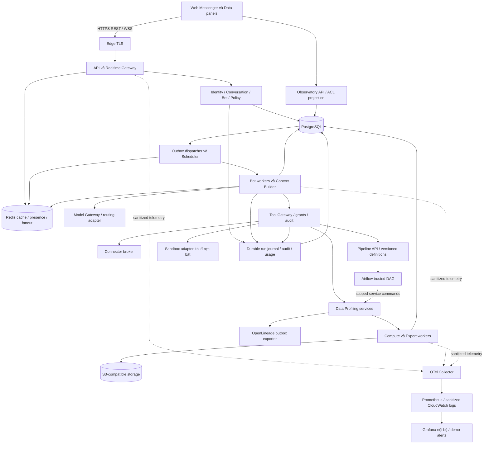

# VDaAgent — kiến trúc platform hội thoại giữa người và bot

> Release contract **R1-DEMO-2026-09**, ngày 15/09/2026: web messenger người+bot, Data Profiling, Observatory và một batch pipeline Airflow. Người dùng xác nhận gần 30 người, 6 tuần, **AWS + GitHub Actions, đủ demo trước; scale sau**. [IMPLEMENT.md](IMPLEMENT.md) là execution contract bất biến; [PLAN.md](PLAN.md) định nghĩa sản phẩm/phân công. R1 chưa phải production GA. Các mục FUTURE về HA/Kubernetes/Jenkins/Argo không thuộc nghĩa vụ triển khai 6 tuần.

## 1. Phạm vi và quyết định nền tảng

VDaAgent hỗ trợ chat người–người, người–bot và nhóm nhiều người cùng nhiều bot trong một workspace. Người dùng tạo bot có danh tính, nhiệm vụ, công cụ và bộ nhớ riêng; thêm bot vào cuộc hội thoại; gọi bằng mention/reply; theo dõi công việc và nhận kết quả có bằng chứng ngay trong chat. Data panel bên cạnh chat hiển thị dataset, chart, evidence và report.

Một bot có thể tham gia nhiều cuộc hội thoại nhưng không trộn lịch sử, bộ nhớ riêng hoặc quyền dữ liệu giữa các phòng. Bot tạo subagent cho nhiệm vụ có giới hạn; subagent không tự trở thành thành viên nhóm. Bot khác có thể nhận bàn giao một giai đoạn qua backend.

Các quyết định áp dụng xuyên suốt:

- Bốn template R1: DataAssistant, DataSteward, DataAnalyst, ReportWriter; một shared runtime/registry. Chế độ compact chỉ cần DataAssistant với preset quyền được human cấp; team mode có bốn identity, không bắt buộc gọi cả bốn cho mỗi câu hỏi.
- Profiler là compute service; Evidence Validator là bộ kiểm tra bằng code; Reviewer là người có quyền. AI có thể hỗ trợ các công việc đó nhưng không thay thế authority của compute, validator hay người duyệt.
- React/TypeScript cho web; Python/FastAPI cho backend và bot runtime; worker Python cho compute. PostgreSQL giữ trạng thái bền vững; Redis phục vụ realtime và cache; S3-compatible storage giữ file.
- WebSocket là kênh realtime chính. REST phục vụ commands, lịch sử, upload và recovery. MVP không thêm SSE như một event pipeline khác.
- Modular monolith theo miền, chạy API và worker pools riêng. Platform không bắt buộc Kubernetes hoặc một microservice cho mỗi bot.
- Observatory là capability của platform từ M0: activity/run explorer, agent graph, context inspector có ACL, cost/quality và điều khiển phục hồi có audit. Telemetry, durable execution journal và security audit là ba luồng khác nhau.
- Web là client đầu tiên. Voice, mobile, computer/browser automation, marketplace công khai và arbitrary code execution là các phần mở rộng có điều kiện.

### 1.1 Ranh giới release đã chốt

R1 gồm DM/group nhiều người+bot; bot config/grants/memory; bounded subtask/mailbox/handoff; CSV/flat Parquet → profile/quality → Preview/Official → chart/QA → report review/publish/export; same-dataset drift; Observatory; batch S3 pipeline Airflow; bản demo AWS single-host triển khai qua GitHub Actions. Week6 nghiệm thu demo theo mục15.1, không triển khai scale ngay và không tự động GA theo lịch.

FUTURE: Kafka/CDC/continuous streaming, Spark/Flink/lakehouse, arbitrary SQL/Python/DAG/MCP từ user, third-party plugins, cross-workspace/cross-room delegation, dynamic bot spawn từ LLM, vector DB, routing Switchyard live, mobile/voice, active-active multi-region, autonomous remediation và raw prompt capture. Không implement stub trả success cho phần FUTURE; API không expose hoặc trả feature_disabled rõ ràng.

FUTURE infra gồm EKS/K8s/Helm, Jenkins/Argo, multi-zone HA, full LGTM cluster và 24/7 SRE. Giữ thiết kế/ownership để chuyển sau, không viết runtime phụ thuộc Kubernetes. R1 demo giữ auth/ACL/evidence/fencing/backup nhưng dùng targets riêng; production SLO/PRR chỉ là gate trước GA tương lai.

Mọi con số size/load/SLO ở đây là acceptance target phải đo. Nếu không đạt deadline thì báo NO-GO/đề nghị đổi scope cho human, không tự bỏ gates hay đổi baseline. Binding account/domain/region/model ID/secrets/budget do deployment owner cung cấp trong manifest ngoài IMPLEMENT; không đoán credentials hoặc tự phát sinh chi phí.

## 2. Rakazo thực sự làm gì?

### 2.1 Phạm vi xác minh

Đã đọc schema, source và các test tiêu biểu ở snapshot local **9c59d748ff61cf11735cdaa55ecd92b27e7f1369** của [Rakazo](outsource-main/rakazo/README.md). Worktree sạch khi kiểm tra. Đây là review tĩnh, không phải kết quả chạy test hoặc đo hệ thống live.

[VISION](outsource-main/rakazo/VISION.md) mô tả bot là đồng đội có danh tính và trạng thái tồn tại lâu dài. Các kết luận dưới đây được đối chiếu code, không chỉ suy từ README.

| Cơ chế đã thấy | Nguồn local | Quyết định cho VDaAgent |
| --- | --- | --- |
| Bot có name/title/description/instructions/color, model/thinking config, parent, memoryScope, routines, scratchpad, home, artifacts, MCP và secret bindings | [schema.prisma](outsource-main/rakazo/packages/db/prisma/schema.prisma), model Bot | Bot là entity bền vững, cấu hình có version |
| Một bot có thread riêng; group có thread riêng với thành viên bot | Schema Thread/ChatGroup/ChatGroupMember; [groups.ts](outsource-main/rakazo/packages/db/src/groups.ts) | Xây ConversationMember hỗ trợ human/bot; không lấy ràng buộc một bot–một thread |
| Tạo group kiểm bot cùng spaceId và userId; group member chỉ có botId | assertOwnedBots trong groups.ts | Không coi đây là bằng chứng có native Messenger nhiều người với ACL từng phòng |
| spawn_bot tạo bot lâu dài, thread, parentBotId, spawnKey, optional initial run | [child-bots.ts](outsource-main/rakazo/packages/adapters/src/child-bots.ts) | Tách lifecycle bot và subtask; tạo bot cần capability/quota |
| run_subagent tạo Agent trong lượt cha, messages ban đầu rỗng, nhận task; lọc delegation tools, chặn nesting; gate tối đa 4, result tối đa 12.000 ký tự | [pi-runtime.ts](outsource-main/rakazo/packages/adapters/src/pi-runtime.ts), executeSubagent | Giữ context/task riêng và budget chung; lưu subtask durable của mình, không coi helper in-process này đã là distributed worker |
| message_bot gửi bất đồng bộ vào chat của bot đích, cùng user/space; chặn self-send và duplicate | [bot-messages.ts](outsource-main/rakazo/packages/adapters/src/bot-messages.ts), [tests](outsource-main/rakazo/packages/adapters/src/bot-messages.test.ts) | Mailbox có correlation, ACL, idempotency; không tự mở DM của người khác |
| handoff_to_bot tạo message/task/run trong cùng group; kiểm active source/member/replay/hop/bounce-back | [group-handoff.ts](outsource-main/rakazo/packages/adapters/src/group-handoff.ts), [tests](outsource-main/rakazo/packages/adapters/src/group-handoff.test.ts) | Mỗi stage một owner; handoff có transaction |
| Bot message chain giới hạn 6 hop; peer text/directory là dữ liệu không tin cậy | [core/bot-messages.ts](outsource-main/rakazo/packages/core/src/bot-messages.ts) | Giới hạn hop + tổng task/cost; peer không tạo quyền mới |
| Mention chọn bot; @everyone gọi các bot; không chỉ định thì chọn bot đầu tiên | [group-mentions.ts](outsource-main/rakazo/packages/core/src/group-mentions.ts) | Đổi default: nhóm human không mention/reply thì không đánh thức bot |
| Markdown memory lưu PostgreSQL, revision atomic; scope bot/user; search hiện là substring content/path | [memory/index.ts](outsource-main/rakazo/packages/memory/src/index.ts) | Không gọi native memory này là vector/FTS; giữ version và audience |
| Nạp memory bot/user, ưu tiên bản mới; toàn block giới hạn 32 KiB | [memory-context.ts](outsource-main/rakazo/packages/adapters/src/memory-context.ts), [tests](outsource-main/rakazo/packages/adapters/src/memory-context.test.ts) | Byte cap chưa đủ; thêm token budget và audience filter trước khi nạp |
| Semantic memory là adapter tùy chọn, isolated/shared, history generation | [interfaces.ts](outsource-main/rakazo/packages/adapter-kit/src/interfaces.ts), [types.ts](outsource-main/rakazo/packages/adapter-kit/src/types.ts) | Durable memory không phụ thuộc vector service |
| Compaction batch 50; window 50/legacy 200 theo điều kiện; summary cap 20.000 ký tự, transcript 40.000, timeout 120s; CAS cursor/generation và kiểm continuity | [history-compaction.ts](outsource-main/rakazo/packages/adapters/src/history-compaction.ts), [tests](outsource-main/rakazo/packages/adapters/src/history-compaction.test.ts) | Học cursor/CAS/gap detection; không lấy các số này làm token budget mặc định |
| compactHistory return khi thread không có botId, gồm group thread | Cùng history-compaction.ts và schema Thread | Compaction cho nhóm người+bot phải xây mới |
| Runtime ghép instructions, memory, scratchpad, group roster, history/summary, tools; external messaging có đường bỏ private memory/scratchpad | [executor.ts](outsource-main/rakazo/packages/adapters/src/executor.ts) | Context Builder phải kiểm conversation audience, không chỉ botId |
| Builtin tools, connector/MCP tools, skills; lazy catalog search/load/execute | [builtin-tools.ts](outsource-main/rakazo/packages/adapters/src/builtin-tools.ts), [lazy-tool-catalog.ts](outsource-main/rakazo/packages/adapters/src/lazy-tool-catalog.ts), [skill-tools.ts](outsource-main/rakazo/packages/adapters/src/skill-tools.ts) | Versioned grants và schema nạp theo nhu cầu; skill không tự cấp quyền |
| Reusable bot secrets mã hóa và backend inject vào origin được cấp | [bot-secrets.md](outsource-main/rakazo/docs/bot-secrets.md) | Model chỉ nhận reference, không nhận raw credentials |
| Team/private computer có checkpoint/isolation riêng; Pi JSONL recording opt-in, mặc định tắt | [computer-runtime.md](outsource-main/rakazo/docs/computer-runtime.md), [pi-session.ts](outsource-main/rakazo/packages/adapters/src/pi-session.ts) | Bot có working namespace; không cần VM thường trực hay raw transcript trên filesystem |
| API/worker dùng Graphile jobs, PostgresRealtimeFanout | [app.ts](outsource-main/rakazo/apps/api/src/app.ts), [worker/index.ts](outsource-main/rakazo/apps/worker/src/index.ts), [events.ts](outsource-main/rakazo/packages/db/src/events.ts) | Redis là quyết định riêng của VDaAgent, không gán cho Rakazo |

### 2.2 Kết luận nghiên cứu

Giữ các nguyên tắc: bot bền vững, công cụ được cấp, memory có revision, subtask khác bot mới, handoff có kiểm soát, durable events và recovery. Phải xây thêm: human+bot membership theo phòng, read cursor theo người, ACL lịch sử/dữ liệu, context nhóm, nhiều thiết bị, profiling/evidence/report.

Rakazo có license Apache-2.0; phần lấy lại cần giữ attribution/notice phù hợp. Hai bản Grok-bot reconstructed/recovered trong outsource-main là tư liệu hành vi/provenance, không là runtime dependency. Không chạy installer hoặc thay đổi các repo tham khảo trong lần viết lại này.

## 3. Solution architecture và stack

### 3.1 Ba lớp platform

| Lớp | Sở hữu | Giới hạn |
| --- | --- | --- |
| Platform core | Identity, workspace, conversation, bot, run, memory, tool registry, policy, quota, audit, Observatory | Không import nghiệp vụ sales/profiling vào messaging |
| Domain pack data-profiling | Dataset, ingestion, profile, analysis, chart, drift/test, evidence, report | Dùng auth/jobs/storage của platform |
| Adapters | Model, connector, storage, sandbox, realtime, search, export | Vendor SDK chỉ nằm adapter/composition root |

Bỏ domain pack vẫn chat, tạo bot và chạy tool được cấp. Thêm pack khác qua tool handlers, resource schemas và card contracts; không sửa message pipeline. Đây là tiêu chí tái sử dụng để đánh giá platform.



Sơ đồ là ranh giới logic, không yêu cầu một container mỗi ô. API nhận command nhanh; bot worker chờ model; compute/export worker chạy việc nặng. Cùng codebase nhưng worker pools riêng để profiling không chặn chat.

### 3.2 Stack chốt

| Thành phần | Lựa chọn | Quyết định triển khai |
| --- | --- | --- |
| Web | React, TypeScript, Vite, TanStack Query | Virtualized message list, query keys chứa tenant/conversation, typed cards |
| REST/realtime | FastAPI/Starlette WebSocket, Pydantic, OpenAPI + JSON Schema | Command handlers dùng chung REST/WS; không hai pipeline state |
| Domain/runtime | Python application services, typed state machine | Không bắt buộc swarm framework; platform sở hữu run/checkpoint |
| DB | PostgreSQL, SQLAlchemy, Alembic | Transactions, scoped constraints, jobs/outbox/audit |
| Ephemeral state | Redis qua redis-py | Presence, typing, context cache, fanout, rate limit |
| Storage | S3 API qua ObjectStore adapter | Private buckets, versioned inputs; local dùng emulator đã pin |
| Compute/quality | DuckDB + PyArrow + SciPy; native versioned QualityEngine | Không Pandas/Polars/GX/Spark R1; semantics mục 9.6 |
| Data orchestration | Airflow 3 riêng dependency env, LocalExecutor parallelism=2, 1 reviewed DAG template | Trusted batch chỉ gọi core API; FUTURE KubernetesExecutor |
| Lineage | OpenLineage JSON exporter qua outbox | Versioned metadata; internal evidence vẫn authority; không cần Marquez |
| Chart/report | Vega-Lite subset; Jinja2 HTML + Playwright/Chromium PDF | Validated schema, export worker không fetch network tùy ý |
| Jobs | PostgreSQL job ledger + lease/fencing + outbox | Không thêm Celery/Redis Streams/Graphile cùng lúc |
| Model | httpx, Anthropic Messages adapter + deterministic fake provider | Model ID/capabilities/pricing pin trong deployment manifest; Switchyard FUTURE |
| Auth | OIDC Code + PKCE qua SSO hiện có, server session | Local dùng OIDC test issuer, không password store riêng |
| Observatory sản phẩm | React + FastAPI, PostgreSQL journal/read models, WS recovery | Tenant và resource ACL; không nhúng Grafana có quyền rộng |
| Telemetry R1 | OTel instrumentation/Collector + Prometheus/Grafana; structured logs CloudWatch | Product journal chính; Tempo/Loki/HA telemetry FUTURE |
| Infrastructure R1 | AWS EC2 single app host + Compose, RDS PostgreSQL Single-AZ, S3, ECR, Secrets/KMS, Cognito, ALB/ACM | Terraform demo stack, Ansible host bootstrap; Redis container ephemeral |
| CI/CD R1 | GitHub Actions + AWS OIDC, protected demo environment, ECR digest + SSM deploy | Không Jenkins/Argo/K8s; không SSH key dài hạn/Docker socket cho app |

Người dùng hiện có AWS, chọn GitHub Actions và chưa cần scale. M0 bind account/region/domain/budget/model/secret refs, không hỏi chọn lại cloud/CI. Local Compose dùng PostgreSQL/Redis/S3 emulator/OIDC test issuer, cloud demo dùng RDS/S3/Cognito. Chưa có binding/permission thì block cloud apply riêng; local/core/data vẫn làm bằng fixtures. Tạo resources phải có human approval về account/plan/chi phí, không được suy từ việc yêu cầu viết tài liệu.

AWS Terraform backend dùng S3 native use_lockfile=true+versioning; không thêm DynamoDB locking deprecated. FUTURE EKS phải bật VPC CNI NetworkPolicy enforcement và test deny thực tế, không coi YAML tự có hiệu lực. [Terraform S3](https://developer.hashicorp.com/terraform/language/backend/s3), [EKS network controls](https://docs.aws.amazon.com/eks/latest/best-practices/network-security.html)

Toolchain: Python 3.13 + uv lock, Node 24 LTS + pnpm lock, Pydantic v2, PostgreSQL 17; supported exact patches/image digests/K8s version được resolve một lần tại M0 và ghi `config/versions.lock.yaml`. Chỉ nâng versions bằng reviewed dependency PR và conformance; không dùng floating latest. Không pin số patch chưa kiểm tương thích như thể đã install.

Python 3.13 là baseline khai báo của repo, chưa phải môi trường đã sẵn sàng: interpreter đó chưa có trong lần kiểm tra trước, pyproject.toml chưa có dependencies. Scaffold phải khóa versions và kiểm tương thích. Danh sách trên là lựa chọn thiết kế, không phải thư viện đã cài.

### 3.3 Tổ chức code

```text
apps/web/                    Messenger UI, bot settings, domain cards, Observatory
services/api/                REST, WS, sessions, command/query handlers
services/bot_worker/         dispatch, context, model loop, subtask/mailbox
services/compute_worker/     ingestion, profile, bounded query, drift/test
services/export_worker/      HTML/PDF export
services/control_worker/     outbox, leases, schedule dispatch, projections
pipelines/airflow/           trusted DAGs, operators, adapters; dependency env riêng
packages/platform/           identity, conversation, bot, runtime, memory, policy
packages/platform/observatory/ journal projections, inspections, recovery commands
packages/contracts/          OpenAPI/event/tool schemas, generated TS client
packages/data_profiling/      domain services, evidence, report workflow
packages/adapters/            provider/storage/search/connector/sandbox
infra/                       migrations, containers, monitoring, runbooks
```

Chỉ module owner được ghi bảng của nó. Cùng DB cho phép transaction xuyên module qua application service; không để router hoặc plugin ghi SQL tùy ý. Tách process không có nghĩa tách database ngay.

### 3.4 System-design trade-offs và đường mở rộng

Đã nghiên cứu các phần performance/scalability, consistency, cache, queue/backpressure và sharding của System Design Primer. Học cách đánh giá trade-off; không coi tài liệu học system design là chứng nhận production hoặc lý do lắp mọi công nghệ. [System Design Primer](https://github.com/donnemartin/system-design-primer)

Các quyết định cụ thể dưới đây là thiết kế của VDaAgent:

| Boundary | Consistency / lựa chọn | Khi scale |
| --- | --- | --- |
| Membership, quota, publish, message commit | Transaction/primary authority; mất DB thì không nhận thành công giả | Tối ưu indexes/locks/pools trước khi partition |
| Presence/typing/telemetry | Best effort, chấp nhận thiếu; không làm authority | Tách pool/topic, giới hạn fanout và cardinality |
| Summary/search/Observatory rollup | Derived và eventual; watermark + live ACL | Rebuildable projections, replicas chỉ cho reads không authorize |
| Context cache | Cache-aside, versioned key, bounded single-flight và TTL jitter | Không write-behind durable memory; chống stampede |
| Files/assets | CDN chỉ public versioned web assets | Private dataset/export không shared-cache; signed grant kiểm tại broker |
| Messaging scale | Ordering theo conversation, không global total order | Room hot: admission cap/batching; không phá seq để lấy throughput |
| Multi-region tương lai | Workspace home-region, single writer, failover fencing | Chưa active-active write; phải ADR cho residency/RPO/cross-region grants |

Capacity worksheet phải tính riêng connections, sends, fanout, bot calls, compute và lưu trữ. R1 demo dùng 100 WS/20 rooms/10 sends/s, tối đa 4 root runs và 1 compute job toàn deployment. FUTURE scale fixture 1.000 WS/200 rooms/50 sends/s, fanout trung bình10 →500 deliveries/s; 2KiB/event khoảng1MiB/s chưa TLS/replay. Nếu duy trì50 sends/s cả ngày:4,32 triệu messages/~8,6GB payload trước indexes/replication. Đây là planning, không số đo người dùng thực tế.

Ước lượng in-flight model calls bằng arrival rate × mean duration; ví dụ 2 calls/s × 20s = 40 calls cùng lúc trước retries/helpers. Không suy số replicas từ riêng QPS. Benchmark phải ghi peak/average, heavy-room skew, bot mention ratio, row width và object retention; budget bao gồm DB/egress/telemetry chứ không chỉ LLM.

Ngưỡng mở rộng: nếu bottleneck DB được chứng minh sau query/index/pool tuning thì partition bảng append-only theo thời gian, thêm read models và archive; chỉ shard theo workspace khi một primary không còn đạt SLO với headroom. Shard routing phải versioned, migration freeze/copy/verify/cutover và scoped constraints; không bỏ RLS/ACL. Chỉ thêm broker riêng sau khi job/outbox throughput làm ảnh hưởng message commit; giữ JobStore/idempotency contract. Các thay đổi này cần load/failure evidence, không là dependency của release đầu.

## 4. Identity, conversation và bot

### 4.1 Quyền và membership

Organization sở hữu workspaces và usage account. Workspace là tenant boundary. Principal có loại human/bot/service; human có thể thuộc nhiều workspace. Conversation thuộc một workspace, loại direct/group; human–human, human–bot và nhóm human+bot dùng chung pipeline.

ConversationMember lưu principal, owner/moderator/member, joined/left times, visible_from_seq và quyền invoke/steer bot. Workspace admin không mặc nhiên đọc DM; hỗ trợ đặc biệt cần quyền riêng được audit. MVP không có chat xuyên workspace.

Member leave/rejoin tạo membership interval mới, không overwrite joined_at để phục hồi lịch sử cũ. Active membership unique(conversation,principal); mỗi interval có visible_from_seq, historical grants riêng. R1 chỉ current membership được đọc; rejoin mặc định từ lần mới, mở lịch sử là human share đã audit.

Mỗi run lưu initiated_by, acting_bot_id, conversation_id, delegation_chain, policy_version, grant_version và billing_account_id. Effective permissions là giao của workspace policy, actor permission, bot grants, conversation scope và task grant. Handoff không nâng lên quyền của chủ bot đích; bot là identity thực thi, không phải cách mượn quyền admin.

Invoke grants (tool được trực tiếp gọi) khác delegation grants (được giao operation cho template đích). Peer execution = live root-actor authority ∩ task grant ∩ source delegation grant ∩ target invoke grant ∩ audience/policy. Coordinator có thể giao profiling dù không trực tiếp có profile.start; không thể vay quyền của owner bot đích. Subagent chỉ dùng tập con effective invoke grants của parent.

R1 roles: workspace Viewer đọc resources đã được share; Editor tạo dataset/run/draft/bot trong scope; Owner quản membership/policy và human approve/publish. Room owner/moderator quản membership không tự thành Owner workspace. Read permission của file/report phải có resource_grant cùng workspace; public ID không là quyền. Mỗi thay đổi membership/resource grant tăng policy_generation trong transaction; context, output commit và subscription batch so generation với primary.

### 4.2 Mỗi bot có những gì?

| Tài sản | Ownership/scope | Lifecycle |
| --- | --- | --- |
| Identity | botId, owner, workspace, name/avatar/title/description | Bền vững; đổi tên không đổi ID |
| Instructions | Role, phong cách, nhiệm vụ; config_version | Update tạo version mới; run pin version |
| Model policy | Allowed connections/models, routing, context/output budget | Credential reference, không raw key trong prompt |
| Tools | Tool IDs/versions, operations/resources được cấp | Default deny; revoke kiểm trước call tiếp |
| Skills | Hướng dẫn/template versioned, assignment cho bot | Không tự cấp quyền hay tự chạy code |
| Memory | Bot theo conversation; shared knowledge có grant riêng | Revision/source/audience/expiry; sửa/quên/export |
| Scratchpad | Việc chưa xong, assumptions, checklist | Theo conversation/run; không là evidence |
| Working files | Namespace bot + conversation, artifact refs | Temporary filesystem mỗi job; persist outputs cần giữ |
| Connections | Bindings tới connection user/workspace | Dùng chung account qua grant, không copy secret cho từng bot |
| Routines | Prompt, timezone, owner, conversation, budget | DB schedule; kiểm lại quyền khi chạy |
| Execution policy | Domains, sandbox, fan-out, hop/tool/time/cost caps | Snapshot cấu hình; authorization vẫn kiểm hiện hành |
| History | Các message được phép trong từng conversation | Không nhập DM này vào nhóm khác |
| Presence | Idle/running/waiting từ run state | Không yêu cầu bot có process thường trực |

Tạo bot không provision VM hay cấp mọi tool. Archive dừng schedule/run mới; restore dùng quyền hiện tại. Clone/share chỉ sao chép template được phép, không copy private memory/history, credential, files hoặc browser identity. Xóa có retention/tombstone để tin nhắn cũ còn attribution phù hợp.

Routine lưu timezone IANA, quy tắc DST/misfire và concurrency policy. Mặc định coalesce các lần bị lỡ thành một lần, không chồng run cùng routine; unique routine_id + scheduled_at chống enqueue trùng. Quyền owner, membership, grants và budget được kiểm lại tại thời điểm chạy.

### 4.3 Bot khác subagent và service

| Khái niệm | Bền vững | Hiển thị | Quyền quyết định |
| --- | --- | --- | --- |
| Bot | Có | Thành viên chat, avatar, tin nhắn | Trong grants và quyền actor |
| Subagent | Chỉ trong task/run | Card tiến độ/kết quả dưới bot cha | Tập con quyền cha; budget chung |
| Compute/tool service | Service identity | Result card | Validate input và thực thi code có version |
| Evidence Validator | Domain service | Evidence status | Kiểm binding/source/result theo code |
| Human Reviewer | User identity | Review/approval card | Approve/publish qua server policy |

R1 cài bốn templates với grants cụ thể ở mục 8.2. Human tạo/config/archive bot; LLM không có create_bot/grant/secret/admin tools. Compact preset của DataAssistant được human bật có thể dùng union data tools của bốn roles trong cùng ACL/budget, không tăng quyền actor và không bật human-only actions. AI kiểm tra diễn giải chỉ là recommendation; không bot nào tự nhận authority của Reviewer.

## 5. Messenger và realtime

### 5.1 Message và trạng thái người dùng

Message gồm id, workspace_id, conversation_id, seq, sender_principal_id, client_message_id, reply_to_id, mentions theo ID, blocks, revision, timestamps và optional run_id. Blocks gồm text, attachment, chart, evidence, question, progress, report link. Tin nhắn peer luôn có attribution, không biến thành system instruction.

Read cursor, mute, notification preferences lưu theo human/conversation. Multi-device cập nhật last_read_seq bằng max. Sent = DB committed; delivered = ít nhất một device ACK; read = human cập nhật cursor. Không dùng một boolean unread cho cả nhóm.

MVP có DM/group, add/remove member, mention/reply, attachment, reactions, edit/delete có revision, typing/presence và read state. Reply là reference trong conversation, chưa cần nested channel tree hoặc collaborative document editor.

### 5.2 Gửi tin và khôi phục

1. Client gửi command với client_message_id; server kiểm session/member/schema/size.
2. Trong transaction, lock conversation counter, cấp seq, ghi message + conversation event + outbox. Unique key là conversation + sender + client_message_id.
3. ACK chỉ sau commit. Cùng key/payload trả kết quả cũ; cùng key nhưng payload khác trả conflict.
4. Dispatcher publish wake-up qua Redis. Realtime gateway đọc durable events sau cursor rồi đẩy WS.
5. Reconnect lấy high-watermark, catch-up từ cursor và tiếp tục đọc sau đó; dedup theo event ID. Message seq khác event seq.
6. Gateway định kỳ so high-watermark để phát hiện wake-up bị mất dù WS còn mở. Slow client có bounded buffer, bị ngắt rồi resume thay vì chiếm RAM vô hạn.

Message commit không rollback vì quota bot: mỗi mention có dispatch_outcome admitted/rejected/pending được lưu, UI hiển thị BOT_QUOTA_EXCEEDED riêng. Dedup admission theo message_id + bot_id + input_revision. REST và WS cùng handler; send không cần chờ provider. Cursor read không vượt message high-watermark được phép; delivered cursor theo device, read cursor theo human.

Redis Pub/Sub có thể mất event khi subscriber disconnect. Vì vậy message delivery khôi phục từ PostgreSQL; Pub/Sub chỉ đánh thức consumer, còn typing/presence là best effort. [Redis delivery semantics](https://redis.io/docs/latest/develop/pubsub/#delivery-semantics)

ConversationEvent chỉ chứa payload cùng audience với conversation. Private diagnostic, secret input và raw tool output nằm resource/stream riêng có ACL; không gửi rồi nhờ UI ẩn. Khi event retention hết, trả CURSOR_EXPIRED và yêu cầu đồng bộ snapshot/lịch sử lại.

Gateway kiểm membership/grant hiện hành trước khi chuyển mỗi batch, không chỉ lúc subscribe và không phụ thuộc thông báo revoke qua Redis. Kết quả run cũng phải kiểm audience tại commit và delivery; đổi thành viên trong lúc model chạy không được mở quyền chia sẻ dữ liệu riêng. Dữ liệu đã được gửi hợp lệ tới thiết bị không thể bảo đảm thu hồi khỏi thiết bị đó.

### 5.3 Quy tắc gọi bot và chia sẻ lịch sử

- DM human–bot: tin mới mặc định gọi bot.
- Group: explicit mention/reply gọi bot; no-mention là chat người–người. Room owner có thể bật default assistant.
- Mention nhiều bot tạo tasks riêng, tổng quota được reserve. Bot messages không tự đánh thức tất cả bot.
- Một task stage có một owner; ownership khác quyền gửi tin vào nhóm.
- Thành viên mới mặc định thấy từ visible_from_seq; mở lịch sử cũ là hành động chia sẻ rõ ràng. Summary không vượt giới hạn này.
- Rời nhóm/revoke bot chặn đọc/tools/publish mới, đóng subscription; runs do actor đã mất quyền bị dừng theo policy mặc định.
- Tệp riêng không tự được chia sẻ chỉ vì attachment ID xuất hiện trong message; phải có resource grant rõ ràng.

## 6. Bot runtime và agent-to-agent communication

### 6.1 Run, attempt và lease

```text
queued → leased → running → completed | handed_off | failed | cancelled
                    └→ waiting → queued
waiting.reason = input | approval | children | tool | peer
```

Task là mục tiêu; Run là lần theo đuổi input/config đã pin; Attempt là lần worker claim; ToolExecution là một operation logic có thể retry an toàn. Chỉ một main run ở queued/leased/running/waiting mỗi conversation+bot; message tiếp theo xếp hàng hoặc steering được cấp. Helpers có execution identity riêng, không chiếm main-run slot của parent, nhưng dùng cùng root budget. Cùng bot ở hai phòng không dùng chung history/memory. Shared memory update dùng optimistic revision.

Lease lưu owner/deadline/fence tăng dần; reconciler xử lý leased/running quá hạn bằng attempt mới của cùng run. Waiting lưu reason/wake condition/deadline, không giữ worker hoặc transaction; wake idempotent và hết hạn thì failed/wait_expired. Commit kiểm fence và quyền hiện hành. Response có question/approval ID, expected version và quyền người trả lời. Retry terminal hoặc sửa input/config/context tạo linked run mới (supersedes_run_id), không tái dùng idempotency key của side effect cũ.

### 6.2 Steering và cancellation

Run pin source message, input high-watermark, analysis_session_id và context_version. Tin mới kèm target_run_id hoặc reply có thể steering nếu người gửi có quyền. Người khác trong nhóm không mặc nhiên sửa task initiator; nếu chưa có quyền thì tạo đề xuất/task riêng.

Đổi filter tạo context version mới; kết quả đang chạy theo version cũ bị supersede hoặc lưu như lịch sử có nhãn. Official mới cần version yêu cầu. Cancellation cascade xuống subtasks; side effect đã gửi không tự undo, phải đối soát trạng thái unknown.

### 6.3 Subagent

Subtask lưu parent run, role/task, input refs, context manifest, output schema, delegation grant, deadline và token/tool/cost budget. Default đề xuất: tối đa 3 subtask đồng thời/run, depth 1, tổng 8 subtasks/root task; đây là policy pilot cần benchmark.

Subagent nhận packet được chọn, không copy toàn lịch sử cha. Kết quả dài lưu artifact, trả summary + refs + status + limitations. Parent validate schema/evidence trước khi dùng. Subtask/checkpoint durable cho phép worker khác retry; parent không phải sống mãi trong RAM. Không cho subagent tự tạo bot hay cấp grant.

### 6.4 Mailbox và handoff

| Operation | Ý nghĩa | Quy tắc |
| --- | --- | --- |
| run_subagent | Chia phần việc dưới run | Cha chịu trách nhiệm output; shared budget |
| message_bot | Request/question/status/result/fyi tới peer | Durable inbox; không chuyển stage ownership |
| handoff_to_bot | Chuyển stage trong conversation | Target member; transaction đổi owner và tạo next run |
| create_bot | Tạo identity AI lâu dài | Human capability/config/quota; không thay subtask |

Envelope gồm delivery_id, sender/recipient, conversation, task/stage, in_reply_to, root initiator, hop, grant ref và payload refs. Text được phép mô tả task nhưng không cấp quyền. Backend kiểm duplicate/self-send/loop/bounce và target permissions; peer message không giả thành user command.

Default 6 hop/root task; terminal result có delivery riêng một lần về đúng requester, không mở chuỗi mới để vượt quota. Cross-room delegation yêu cầu explicit authorized share; không chuyển DM của người khác. Subagents trao đổi qua mailbox điều phối khi được cấp, không có mạng peer tự do. Đây là giao tiếp agent-to-agent có audit/cancellation, không chỉ “cùng đọc một prompt”.

R1 chỉ delegation trong cùng conversation. Subagents depth=1, max parallel=3/total=8, read-only data/evidence tools; không memory write, create task tiếp, schedule hay report mutation. Mailbox kinds request/question có thể wake peer, status/fyi không tự wake, result chỉ wake correlated waiter. Handoff transaction CAS stage owner + terminal handed_off source + target run/outbox, chống bounce/hop/duplicate. Không await peer trong worker RAM.

Mỗi worker checkpoint lưu model-visible message/tool-result state hoặc protected refs cùng config/input versions. Resume sử dụng ToolExecution operation IDs đã hoàn thành, không gọi lại tool chỉ vì model trace đã mất. Các model calls không có idempotency có thể phát sinh cost lặp khi timeout, phải ghi attempts/unknown usage; không hứa model generation tái lập byte-identical.

## 7. Memory và context window

### 7.1 Các loại state

| Loại | Nội dung | Kho authoritative |
| --- | --- | --- |
| Conversation history | Ai nói gì, reply, edit/delete revisions | PostgreSQL; archive lớn ở object storage |
| Long-term memory | Preferences/knowledge đã ghi nhớ và source | PostgreSQL MemoryDocument/Revision |
| Summary checkpoint | Tóm tắt khoảng message, coverage/generation | PostgreSQL |
| Scratchpad | Pending work/assumptions/input-output refs | PostgreSQL theo conversation/run |
| Working context | Packet cho một model call | Manifest DB; cache Redis |
| Model context window | Giới hạn input/output của model | Capability config được kiểm |
| Evidence | Source/compute/result có version | Domain evidence store, không lấy memory thay thế |

Redis tăng tốc dựng context, không tăng context window. Redis outage không được làm bot mất bản duy nhất của trí nhớ.

### 7.2 Scope và audience

Memory có workspace, owner, scope (user_private, bot_conversation, conversation_shared, workspace_shared), optional bot/conversation IDs, source refs, revision, sensitivity, expiry và deletion generation. Kiến thức của bot dùng nhiều phòng phải được explicit share; DM memory không tự thành bot-global context.

Context Builder lấy giao của actor permission, bot grant, conversation history range và audience đầu ra. Trong group, mặc định chỉ nạp thông tin room được phép nhận. Nếu chưa có authorized projection cho cả nhóm, chuyển sang DM hoặc yêu cầu share rõ ràng. Không cho model đọc private context rồi kỳ vọng prompt “đừng tiết lộ” giải quyết được isolation.

Private preferences cần consent khi dùng; locale UI không cần vào memory nhóm. Tool output mới có audience hẹp phải bị chặn khỏi group model context ngay tại broker. Membership thay đổi giữa run khiến output policy kiểm lại trước publish. Dữ liệu đã đọc bởi thành viên hợp lệ không thể thu hồi bằng cách xóa cache.

### 7.3 Context Builder

1. Resolve current identity/grants, source message cursor và analysis version.
2. Chọn model trong tập được phép, biết context limit/tools/structured-output capabilities.
3. Nạp system policy + bot instructions versioned; task và pinned structured decisions.
4. Nạp summary đúng conversation/audience/generation, recent turns có attribution, relevant memory/evidence và allowed tool schemas.
5. Tính toàn bộ input/schema/image/tool allowance và reserved output trước call. Lưu context manifest source IDs/revisions, config/policy/model/estimator version, token estimate và phần bị lược.
6. Quá budget: giảm retrieval, compact lịch sử cũ, giữ filter/source identity/decisions. Không vừa nữa thì hỏi thu hẹp; không truncate im lặng phần bắt buộc.

Admission: input_tokens + reserved_output_tokens + safety_margin <= model_context_limit. Ví dụ policy cho model 32k: input tối đa 24k, output 4k, margin 4k; không áp dụng cứng cho mọi model. Fallback sang model nhỏ hơn phải dựng context lại. Root budget gồm cả helper, summarizer và router/judge calls.

### 7.4 Compaction nhóm và DM

Summary theo conversation + visibility scope, không chỉ userId/botId. Coverage có from_seq/to_seq, input revision digest, history generation, policy/audience version, decisions, unresolved tasks và evidence IDs. Dùng compare-and-set khi persist summary và nâng cursor; timeout/output rỗng hoặc coverage thiếu thì giữ cursor cũ.

Recent tail phải nối đúng coverage. Hidden/deleted messages có visibility/tombstone manifest; không coi missing row là đã được đọc. Edit/delete tăng generation, invalidate summary/cache bị ảnh hưởng và rebuild từ nguồn còn được phép. Revoke scope khiến checkpoint cũ không dùng được.

Summary là dữ liệu lịch sử, không instruction. Hash kiểm bytes, không chứng minh summary đúng; không gọi là “đã ký” khi chưa có signing protocol. Business definitions/artifact/filter lưu structured state ngoài summary. Summarizer lỗi thì dùng checkpoint còn hợp lệ + task hiện tại hoặc báo thiếu context; không âm thầm bỏ lịch sử rồi nói đã nhớ hết.

### 7.5 Redis data layout

| Key family | Nội dung | Policy pilot |
| --- | --- | --- |
| presence:{ws}:{principal}:{device} | Heartbeat | TTL 60s, heartbeat 20s |
| typing:{ws}:{conversation}:{principal} | Typing | TTL 5s, không persist |
| ctx:{ws}:{conversation}:{bot}:{actor}:{digest} | Authorized context packet | TTL 5 phút; digest gồm history/ACL/memory/config/model/analysis versions |
| rate:{ws}:{principal}:{operation} | Rate counter | Atomic update + TTL |
| fanout:{env}:{ws}:{conversation} | Public event high-watermark | Pub/Sub; events lưu DB |

Mỗi lần dùng cache vẫn kiểm live grant generation; TTL không thay revocation. Không cache raw credential/signed upload URL, không log prompt body. Redis outage dùng DB/polling và context rebuild có giới hạn. Bot admission cần quota reservation DB chính xác; nếu không kiểm được thì trả retryable error.

Search ban đầu dùng PostgreSQL full-text sau ACL filters; vector adapter chỉ thêm khi eval chứng minh lợi ích. Index là projection có thể rebuild, không là authority của quyền. Không chạy cùng ICM, sqlite-vector và zvec chỉ vì đã giữ repo tham khảo.

## 8. Tool, skill, connector và model boundaries

### 8.1 Tool Gateway và registry

Registry entry có stable ID, contract version, description, input/output JSON Schema, effect class, required capabilities, resource selector, timeout, result budget, sensitivity và adapter binding. Call kiểm actor/bot/run/resources/schema/quota, tạo ToolExecution rồi mới chạy handler.

Core tools nạp trực tiếp; catalog lớn dùng search → load → execute theo pattern Rakazo. Search lẫn execute đều lọc grant, tool vừa discover không tự được cấp quyền. Plugin tự khai readOnly không đủ chứng minh không có side effect; cần review/conformance.

Skill là hướng dẫn/template versioned, không tự cài code hoặc vượt permissions. Update skill tạo version mới; chia sẻ skill/memory nâng audience cần policy thích hợp.

### 8.2 Tool catalog v1 và bốn bot R1

Mỗi ID dưới là contract v1 với handler, JSON Schema input/output, capability, effect class, timeout và test riêng. Không có wildcard tool hoặc bot tự cài tool. Cùng tool được nhiều bot dùng thì dùng chung handler, không nhân bản code.

| Template | Trách nhiệm | Invoke groups | Delegation |
| --- | --- | --- | --- |
| DataAssistant | Hỏi rõ nhu cầu, đọc evidence, điều phối và trả lời cuối | COMMON + COLLAB + schedule.list | Chỉ giao operations thuộc grants của Steward/Analyst/Writer đã được root task cấp |
| DataSteward | Nhập/profile, metadata proposal, quality, pipeline/routine | COMMON + STEWARD + SCHEDULE + agent.message/agent.handoff | Trả/giao cho Assistant hoặc Analyst, không tự approve metadata |
| DataAnalyst | Analysis AST, Preview/Official request, chart, drift/tests | COMMON + ANALYST + COLLAB | Read-only helpers; trả/giao Assistant hoặc Writer |
| ReportWriter | Soạn report từ evidence, snapshot, yêu cầu submit/export | COMMON + REPORT + agent.message/agent.handoff | Trả Assistant/Steward/Analyst để bổ sung; không publish |

COMMON=17, COLLAB=3, STEWARD=6, ANALYST=8, REPORT=7, SCHEDULE=3: **44 tool IDs**, ít operations domain hơn vì reads/requests tách. Compact DataAssistant preset là explicit union của các groups này, human bật lúc provisioning; không thêm human-only capability. Default team mode provision bốn template, không tự add vào mọi phòng.

Tất cả nhận server-side ToolContext(workspace, root_actor, bot, run/attempt/fence, conversation, task_grant, audience, budget). Model chỉ gửi business input; không được gửi actor/tenant override. Ref là scoped immutable ID, không arbitrary URL/path. Output chung: status(ok/queued/needs_approval/needs_input/denied/failed), data hoặc job_ref, evidence_refs, limitations, sanitized error(code,retryable,correlation_id). Không trả raw credential/SQL/stack trace.

R=read; W=versioned internal mutation; J=durable job; A=human approval request, chưa execute side effect. Read mặc định deadline 10s/output <=32KiB; mutation/request <=10s/16KiB; job submit <=10s rồi chờ status, compute deadline mục 13.2. Long result trả bounded preview + protected artifact ref.

| ID | Input business bắt buộc | Output / effect |
| --- | --- | --- |
| catalog.search | query, cursor? | granted tool IDs + summary; R, không lộ tool denied |
| catalog.describe | tool_id, version | allowed schema; R |
| user.ask | question, response_schema, audience | question_id/waiting_input; W, không thu secret trong chat |
| runtime.status | run_id | scoped phase/progress/error; R |
| memory.search | query, scope, cursor? | permitted document refs/snippets; R |
| memory.read | document_id, revision? | content + source/audience/revision; R |
| memory.write | path, content, source_refs, expected_revision | own bot_conversation revision; W |
| memory.forget | document_id, expected_revision | own scope tombstone/generation; W |
| scratchpad.read | run_id | own run/bot-conversation working state; R |
| scratchpad.write | run_id, patch, expected_revision | revised working state; W, không evidence |
| evidence.get | evidence_id | binding/verified result cells/limitations; R |
| lineage.get | resource_ref | allowed parent/child graph; R |
| dataset.list | cursor?, query? | allowed datasets; R |
| artifact.describe | artifact_version_id | schema/parse/version/size/status; R |
| profile.get | profile_run_id | metrics+methods+evidence; R |
| metadata.read | artifact_version_id, revision? | column decisions/version; R |
| execution.get | execution_id | status/bounded rows/evidence refs; R |
| agent.subtask | helper_role, task, input_refs, output_schema_id, caps | durable subtask_id; J, chỉ read-only helper contract |
| agent.message | recipient_bot_id, kind, payload_refs, correlation? | mailbox delivery_id; W, audience/hop/dedup |
| agent.handoff | target_bot_id, stage_id, expected_version, brief, refs | source handed_off + target run; W |
| ingestion.import | approved_connection_id, source_manifest_ref, dataset_id | ingestion job_ref; J, pinned S3 keys/versions không URL tự do |
| profile.start | artifact_version_id, catalog_version, config | profile_run_id; J |
| metadata.propose | artifact_version_id, column_id, proposal, reason, expected_revision | proposal_id; W, human endpoint accept/reject |
| quality.evaluate | artifact_version_id, ruleset_version_id, as_of | quality_run_id; J |
| pipeline.request | definition_version_id, interval hoặc backfill_range, destination_conversation | approval_request_id; A |
| pipeline.status | pipeline_run_id | stages/executions/limits; R |
| analysis.open | artifact_version_id, profile_run_id, context | analysis_session_id/version; W |
| analysis.revise | session_id, patch, expected_version | new context revision; W |
| analysis.plan | session_id, context_version, bounded_ast | validated plan_ref/hash hoặc error; W |
| analysis.preview | plan_ref, context_version | preview execution_id; J |
| analysis.official | plan_ref, context_version, budget | approval_request_id; A; human approve mới queue Official |
| chart.create | execution_id, chart_type, column mappings, options | validated card/artifact; W/J |
| drift.compare | baseline/current profile IDs, mapping_version_id, methods | drift_run_id; J |
| statistics.run | artifact refs, mapping, test_id, parameters, assumptions, family_id | test execution_id hoặc needs_input/inconclusive; J |
| report.read | report_id, snapshot_id? | allowed report/version; R |
| report.create | conversation_id, title, template_id | report_id/draft_version; W |
| report.patch | report_id, expected_version, typed section patches | draft_version; W; numeric cells chỉ evidence binding |
| report.snapshot | report_id, expected_version | immutable snapshot_id/hash; W |
| report.request_submit | snapshot_id, human_author_id | approval_request_id; A |
| report.export_draft | report_id, expected_version, format | export job_ref watermark DRAFT; J |
| report.export_published | report_id, format | export job_ref pinned published pointer; J |
| schedule.propose | definition_version_id, cron, timezone, caps, destination | approval_request_id; A, bounded pipeline schedule không Python |
| schedule.list | cursor?, definition_id? | permitted routines; R |
| schedule.cancel | schedule_id, expected_version, reason | request confirmation nếu chưa có explicit human intent; A/W sau server approve |

Human-only endpoints: source connection/secret binding, bot create/grants/config, memory share, metadata.accept/reject, pipeline definition/schedule approval, Official approval, report submit/review/publish, inspection approval, bulk recovery. Bot không có tool generic HTTP/shell/SQL/approve/publish; CI asserts cấm chúng trong registry/grants.

Approval lưu canonical action digest, human_requester, resources/versions, operation, expiry và one-time decision. Human approver phải còn capability/ACL và model không thể tự trả question để giả approval. Submitter của report là người xác nhận submit (không bot), reviewer phải là Owner khác người đó. Sửa source/context/snapshot sau approval làm approval stale; action thực thi vẫn recheck quyền.

Mỗi template có instructions/skill bundle versioned trong repo, model profile, tool/delegation grants, conversation memory và scratchpad riêng. Steward nhớ schema/quality decisions đã được nguồn xác nhận; Analyst nhớ filters/assumptions cùng phiên; Writer nhớ outline/tone/evidence refs; Assistant nhớ goal/decisions/handoffs. Không memory nào thay source of truth hoặc được tự chia sẻ ngoài phòng.

### 8.3 Connections và secrets

Connection thuộc user/workspace; bot được cấp operations/resources cụ thể. OAuth/token nhập qua protected flow ngoài transcript. Secret manager/KMS hoặc encrypted credential store với master key bên ngoài DB, rotation và key IDs. Model chỉ thấy connection reference.

Broker inject credential đúng origin/operation; giới hạn redirect, DNS/private/link-local/metadata IP, response size và timeout. Không mount secret store/Docker socket/host home vào compute. Webhooks kiểm signature/timestamp/replay và mapping target do server sở hữu.

External effects có ledger planned → sent → confirmed/unknown. Provider có idempotency thì dùng execution ID; không có thì unknown phải đối soát, không retry blind ghi lặp. Audit ghi metadata đã redact, không raw token.

### 8.4 Model Gateway và Switchyard

Gateway giữ capability registry, connection binding, data policy, deadline, usage ledger và routing decision. RoutingPolicy chọn model; ModelProvider adapter thực hiện HTTP. Switchyard là adapter routing tùy chọn trong gateway, không thay cả hai boundary hoặc auth platform.

Đã có bản local Switchyard tại commit `fe764190de9fbba9647c330601dd410e8f525006`; [README local](outsource-sub/Switchyard/README.md) xác định standalone server là demo, không dùng production. Chưa tích hợp vào ứng dụng. Chỉ đưa routing adapter vào release sau khi pin version, conformance và eval chứng minh lợi ích; không coi nó cung cấp tenancy/evidence validator. [Switchyard upstream](https://github.com/NVIDIA-NeMo/Switchyard)

Classifier/judge/summary calls cũng chịu data policy và cost budget. Không có model phù hợp thì trả lỗi, không tự chuyển sang provider không được phép. Fallback nhỏ hơn rebuild context; output đang stream lỗi không ghép model khác như một response nguyên vẹn. Model mạnh hơn không làm Preview thành Official.

## 9. Data Profiling domain pack

### 9.1 Ingestion và source identity

Dataset là identity logic; ArtifactVersion là bytes/version bất biến. UploadSession và attempt riêng. State: reserved → uploading → uploaded_unverified → scanning → ready; lỗi đi rejected/quarantined/expired.

Browser upload vào staging key mới bằng URL ngắn hạn. Backend complete multipart và pin object version; worker đọc đúng version đó, kiểm đầy đủ checksum/size/content/scan/parse rồi promote/copy vào canonical namespace mà uploader không có quyền ghi. Không coi multipart ETag là SHA-256, không dùng staging URL làm canonical permission. Retry complete có idempotency; stale/orphan upload có cleanup.

Lưu parser version, delimiter/encoding, decimal/null/timezone policy và excluded rows. Chuẩn hóa Parquet tạo derived artifact với parent hash, không ghi đè original. Chặn oversize/malformed/decompression bomb; connector import như Google Drive phải tạo canonical snapshot nội bộ.

### 9.2 Profiling và metadata

ProfileRun pin artifact, profiler/catalog versions, config hash. Metrics gồm structure, missing, duplicates, cardinality, distributions, outlier/correlation và PII/candidate-key signals. Mỗi metric có denominator, method, units, exact/approximate, sample seed nếu có, null handling và limitations.

LLM đề xuất semantic label/description; metadata decision có reviewer/version. PII/candidate key/business definition cần người xác nhận khi ảnh hưởng quyền hoặc interpretation. Không tìm thấy PII không chứng minh dữ liệu không có PII.

### 9.3 Analysis Session và executions

Một conversation có nhiều Analysis Sessions. Session pin artifact/profile, columns/filters/timezone, metadata revision và context_version. Không có một global “dataset đang chọn” cho mọi task trong nhóm. Sửa context dùng expected version, mismatch trả 409.

Plan là AST allow-list field/operator/aggregate; backend tạo query và bind values. Không nhận SQL/Python tùy ý từ LLM. Preview có thể sample/approximate/expire và luôn gắn label. Official là execution mới dùng đầy đủ source theo plan/filter trong resource budget; timeout phải fail hoặc yêu cầu thu hẹp rõ scope, không ngầm sample.

DuckDB chạy trong process/container job với input mount riêng. CPU/RAM/scratch disk/time được supervisor/cgroup giới hạn; engine config là lớp bổ sung. Chặn external access/extension install, không chia một DB engine không kiểm scope giữa tenants. [DuckDB security guidance](https://duckdb.org/docs/current/operations_manual/securing_duckdb/overview)

Result manifest có source hashes, plan/parameters, source/result row count, schema/order/float serialization rules, engine image digest, metadata/policy/code/catalog versions và result hash. Hash xác nhận bytes, correctness dựa thêm methods/golden fixtures. Floating-point có tolerance/reproducibility class, không hứa mọi engine cho kết quả byte-identical.

### 9.4 QA, chart và drift/test

Quantitative claim bind tới result cell/metric, phép biến đổi đã cấp và evidence ID. Validator kiểm versions/filter/units/approximation/audience; renderer lấy số trực tiếp từ result thay vì tin số LLM tự viết. Free-text interpretation phân biệt với verified numeric facts. Không đủ semantics/evidence thì clarification hoặc abstain.

Không stream raw câu trả lời định lượng vào shared chat trước bước kiểm này. UI có thể nhận typing/progress; answer blocks chứa số liệu chỉ được commit/phát khi đã validate. Validator lỗi thì hiển thị lỗi hoặc phần giải thích có nhãn chưa xác minh, không phát lại claim thất bại như kết quả chính thức.

Chart pin execution, spec sanitized, bounded data, có units/denominator/time range và data table. Drift MVP chỉ cùng logical dataset và mapping đã xác nhận; cross-dataset cần explicit mapping version. Statistical catalog lưu assumptions/sample size/test/statistic/p-value/CI và multiple-testing policy khi phù hợp; không suy causal evidence chỉ từ p-value.

### 9.5 Report và human governance

Draft mutable/versioned → immutable snapshot → submitted → approved hoặc changes_requested → published. Theo mặc định Team 06, human Owner khác submitter mới được approve. Workspace một Owner vẫn tạo draft và export bản draft có watermark, nhưng publish bị chặn tới khi đủ reviewer; không có AI exception ngầm.

Approval pin snapshot hash; sửa draft tạo snapshot mới. Publish kiểm current permissions/quality/evidence, cập nhật published pointer trong transaction. Export published chỉ đọc pointer đó. Bot request workflow, không approve bằng danh tính người khác.

Retention giữ dependencies của published snapshot theo policy. Nếu buộc xóa data, tạo tombstone, evidence_unavailable và thu hồi khả năng verify; không thay số liệu cũ bằng source mới. Hash/tombstone cũng cần phân loại/retention, không mặc nhiên vô hại.

### 9.6 Hợp đồng data R1: parser, metrics, plan và kết quả

CSV: UTF-8 có/không BOM; delimiter explicit comma/semicolon/tab (sniffer chỉ đề xuất cần xác nhận), quote double-quote, decimal '.', ISO dates/timestamps; timezone bắt buộc khi dùng timestamp thiếu offset. Empty/duplicate header bị reject, không silent rename; malformed row reject, không skip ngầm. Null token mặc định chỉ empty field; muốn phân biệt empty string/null phải chọn null sentinel explicit trong parse policy. Whitespace-only không tự trim. Raw bytes được giữ; typed conversion có invalid count, không biến invalid thành null không báo. Parquet chỉ flat primitive columns; nested/list/struct/archives/Excel ngoài R1.

Schema có stable column_id theo artifact và ordinal; mapping qua version phải explicit, không dựa tên cột giống nhau. Typed schema/null/timezone/decimal policy đã confirm là revision trong artifact manifest; đổi policy tạo derived artifact mới. Parser/catalog/image versions và config hash luôn được lưu. Không số liệu nào tính trên uploaded_unverified.

Profile catalog v1 có 28 IDs/families dưới (giá trị tùy kiểu cột), chạy full source trong resource bounds:

| Nhóm | Metric IDs và semantics |
| --- | --- |
| Table (4) | table.row_count, table.column_count, table.duplicate_extra_count=N-distinct_rows, table.duplicate_extra_rate=extra/N |
| Completeness (6) | column.physical_type, column.non_null_count, column.null_count, column.null_rate=null/N, column.empty_string_count, column.whitespace_only_count |
| Cardinality (2) | column.distinct_non_null_count, column.distinct_ratio=distinct/non_null |
| Numeric (6) | column.min, column.max, column.sum, column.mean, column.stddev_sample(ddof=1), column.finite_count |
| Quantiles (3) | column.q25, column.median, column.q75; linear interpolation theo sorted finite values |
| Distribution (3) | column.iqr_outlier_count(strictly ngoài Q1-1.5IQR..Q3+1.5IQR), column.histogram(20 equal-width bins), column.top_values(top20 + OTHER) |
| Relationship (2) | pair.pearson_correlation(pairwise finite,n>=3, constant=>not_applicable), column.single_candidate_key(N>0,no null,distinct=N) |
| Signals (2) | column.pii_signal_counts(fixed detector IDs,no matched raw samples), column.invalid_cast_count(theo conversion policy) |

Histogram dùng [left,right), bin cuối đóng phải; constant column trả một bin, empty/all-nonfinite => not_applicable. Top values tie-break canonical typed value. Pairwise chỉ <=20 numeric columns được chọn, không all-pairs 2.000 cột. NaN/Inf excluded khỏi numeric aggregates và đếm trong excluded_count; empty/null không ép thành zero. Mỗi metric có status(ok/not_applicable/error), typed value/denominator/unit/method_version/exactness/excluded_count/limitations. R1 exact counts/quantiles, float aggregates công bố tolerance; vượt resource thì fail, không âm thầm approximate.

QualityEngine v1 native DuckDB có 8 rule IDs: not_null, unique, range, allowed_values, approved_pattern, row_count_range, schema_matches, freshness. Ruleset immutable/version/hash; freshness pin as_of/timezone. Approved pattern chỉ IDs regex đã review có bounded runtime, không regex tự do. Result pass/fail/error/skipped khác nhau; engine error không là data pass. Great Expectations adapter FUTURE, không thêm Pandas/Spark chỉ để có một validation framework.

AnalysisPlan v1 gồm artifact_version_id, session_id/context_version, filters, group_by, measures, order_by, limit. Filters eq/ne/lt/lte/gt/gte/in/is_null/is_not_null với typed literals; <=20 predicates, depth<=3, IN<=100. <=3 group dimensions; date bucket day/month với timezone explicit; <=10 measures từ count_rows/count_non_null/sum/mean/min/max/distinct_count; output<=1.000 rows. Không joins/subqueries/UDF/SQL string. Server resolve column IDs và parameterize values, thêm deterministic tie-break order. Limit chỉ giới hạn result sau compute, không input của Official.

Preview dùng fixed seeded row sample tối đa 10.000 rows, engine/sample version pin và badge sample; không được làm published evidence. Official tạo execution mới full source/filter trong budget sau human approval. Metadata/policy/source/context thay đổi => stale approval; không promote Preview bytes thành Official. R1 chart types bar/line/histogram, sanitized Vega-Lite subset và same evidence contract.

Execution manifest: source objects/version/SHA, artifact/schema/parse policy, session/context/metadata revisions, plan/parameter hashes, engine image/code/catalog versions, source/selected/excluded/result rows, output schema/order, object hash + canonical_result_hash, actor/time/limitations. Object hash kiểm encoded bytes; semantic result hash dựa typed canonical JSON: ordered columns/rows, integers/Decimal dưới dạng typed strings, UTC timestamps, Unicode không tự normalize, không JSON NaN/Inf. JavaScript không ép int64/Decimal qua float. Float correctness dùng predeclared tolerance trong fixture, không hứa hash giống nhau giữa engine khác.

Drift R1 chỉ same logical dataset + approved mapping: schema changes, null-rate delta, numeric Wasserstein distance (units gốc), categorical Jensen-Shannon distance base2 trên baseline top20+OTHER cố định. Không tự gọi distances là p-value. Statistical catalog gồm Welch independent two-sided(equal_var=false, finite n>=30/group, CI95%) và chi-square 2×K(correction=false,K=2..20,observed/expected>=5 theo conservative policy). User xác nhận independence; alpha=.05, family_id khóa trước run, Holm correction khi nhiều tests. Assumptions không đạt => inconclusive/needs_review, không tự đổi test. [SciPy Welch](https://docs.scipy.org/doc/scipy/reference/generated/scipy.stats.ttest_ind.html), [SciPy contingency](https://docs.scipy.org/doc/scipy/reference/generated/scipy.stats.contingency.chi2_contingency.html)

### 9.7 Batch pipeline Airflow, data events và lineage

R1 một trusted DAG template snapshot_profile_quality_drift_notify.v1: capture approved S3 source manifest → import immutable versions → profile → quality → compare baseline nếu có → tạo scoped notification/evidence refs. Không Official/report publish tự động. PipelineDefinition versioned chứa connection/prefix, parse/profile/ruleset/mapping versions, cron/IANA timezone, destination room và budgets. Human approve trước schedule/trigger/backfill; DAG factory chỉ đọc data-only approved definitions, không code từ bot/user.

Airflow sở hữu lịch/dependencies của data pipeline, không owns bot run và không trực tiếp sửa domain DB. Bot routines cùng một pipeline được route vào Airflow, core scheduler không tạo lần chạy thứ hai. catchup=false, max_active_runs=1/definition; backfill tối đa 31 daily intervals với human confirm/quota, không unbounded catchup. Idempotent identity definition_version+logical_interval+approved_request; task calls dùng pipeline_run_id:step:artifact_ref. Retry Airflow gọi lại canonical operation ID; application worker sở hữu compute attempts/fences, không double execution.

Source manifest capture một lần trước job: S3 bucket/key/version/size/checksum immutable; max 10 objects, mỗi object và tổng bytes trong admission budget. Retry không reread latest; không list nguồn chưa share. XCom chỉ refs/IDs<=16KiB, không bytes/credentials/PII; dataset state ở PG+S3. Revoked owner/connection/room/budget dừng lần kế, pending output kiểm audience; cancellation cascade có mapped IDs. Bot nhận status qua API/Observatory, không truy cập Airflow UI/DB.

Airflow R1 LocalExecutor parallelism=2 trong services riêng trên demo host, metadata DB/role tách core trên RDS (local dùng Postgres dev), trusted first-party authors only, private operator UI. API/scheduler/DAG processor và triggerer nếu dùng đều pin same bundle/version; tasks chỉ gọi canonical core APIs, không thực thi profiling trực tiếp. Host restart phục hồi qua mapped pipeline/operation IDs. KubernetesExecutor/namespace là FUTURE. DAG code có khả năng thực thi/đọc credentials nên RBAC UI không là isolation cho untrusted author. [Airflow security model](https://airflow.apache.org/docs/apache-airflow/stable/security/security_model.html), [LocalExecutor](https://airflow.apache.org/docs/apache-airflow/stable/core-concepts/executor/local.html)

DataPipelineOrchestrator port gồm trigger/get_status/cancel/backfill với bounded request; SourceConnector.capture_manifest/import_snapshot; QualityEngine.evaluate; LineageExporter.emit. Implement concrete R1 adapters, không xây plugin market. OpenLineage exporter từ durable outbox START/COMPLETE/FAIL với stable job/run IDs, input/output dataset version facets và pipeline parent refs; không raw SQL/source secret paths. Internal evidence store vẫn authority; exporter lỗi không invalidate compute. [OpenLineage model](https://openlineage.io/docs/spec/object-model/)

Kafka/DataEventSource là FUTURE: chỉ mở khi có approved streaming/CDC source và explicit offset/window/replay contract; phải xử lý late events, dedup, schema evolution và tạo finite source manifests để profiling tái kiểm chứng. R1 không broker Kafka, schema registry, Spark/Flink, Airbyte/dbt/GX/Marquez. Không nhầm Kafka transactions với atomic commit across PostgreSQL/S3/external tools. [Kafka design](https://kafka.apache.org/41/design/design/)

## 10. Data model và transaction contracts

### 10.1 Bảng theo module owner

| Module | Entities/tables | Constraints |
| --- | --- | --- |
| Identity | organizations, workspaces, principals, memberships, sessions | Tenant/role/permission versions |
| Conversation | conversations, members, messages, revisions, reactions, read_cursors, events | Human/bot membership, sequence, client-message uniqueness |
| Bot | bots, config_versions, tool_grants, skill_versions/assignments, connection_grants | Versioned grants, lifecycle; không threadId unique trên bot |
| Runtime | tasks, stages, runs, attempts, subtasks, mailbox_deliveries, tool_executions, effects | Idempotency, owner/fence, root-task budget |
| Memory | documents, revisions, checkpoints, context_manifests, scratchpads | Audience/source/generation/CAS |
| Data | datasets, upload_sessions, artifact_versions, ingestion_attempts, profile_runs, metadata_decisions | Immutable scoped refs |
| Data pipeline | pipeline_definitions/versions, pipeline_approvals, pipeline_runs/stages, source_manifests, ruleset_versions, quality_runs, drift_runs, test_families | Approved schedules, pinned sources, Airflow IDs, replay/idempotency |
| Analysis | sessions, context_revisions, plans, executions, evidence_refs | Full source/context/result bindings |
| Governance | reports, snapshots, review_decisions, published_pointers | Immutable snapshot, human reviewer != submitter |
| Operations | jobs, outbox, schedules, usage_ledger, quota_reservations, audit_events | Durable retry, unique idempotency, billing reconciliation |
| Observatory | run_events, inspection_sessions, recovery_requests, run_summaries, evaluation_runs | Journal durable có audience; read models rebuild được; commands qua domain owner |

Mọi tenant record có workspace_id. Composite FK workspace+resource ngăn tham chiếu khác tenant; kiểm conversation ACL thêm ở application. Public IDs không thay authorization.

RLS là defense-in-depth bắt buộc cho tenant tables; app role không superuser/BYPASSRLS. Dùng transaction-local scope, không để tenant variable sót trên connection pool. Kiểm table-owner/FORCE RLS bằng migration và integration tests; không dùng RLS thay grant logic trên objects/connectors. [PostgreSQL RLS](https://www.postgresql.org/docs/17/ddl-rowsecurity.html)

### 10.2 Jobs, outbox và effects

Command mutation + job/outbox + audit quan trọng ghi cùng transaction. Worker claim theo eligibility/time/priority bằng FOR UPDATE SKIP LOCKED, tăng fence rồi commit ngay. Không giữ transaction trong khi chờ LLM/compute. Fair-share workspace, concurrency caps, heartbeat và dead-letter/manual retry là phần bắt buộc.

Processing là at-least-once; unique keys/fences chống duplicate outcome, không tuyên bố exactly-once network call. Result object ghi theo attempt key, verify hash rồi transaction commit pointer. Orphan objects GC sau grace period.

Entity tables authoritative; không event-source toàn bộ domain. Events có schema version, eventId, scope, correlation/causation IDs. Conversation sequence cấp transactionally; private streams không lẫn public sequence. Outbox thất bại không làm mất message đã commit; reconciler có thể drain lại.

## 11. Networking và API

### 11.1 Trust zones

| Luồng | Protocol | Control |
| --- | --- | --- |
| Browser → edge → API | HTTPS REST, WSS /v1/realtime | Session/Origin, membership từng subscription, rate/payload limits |
| Browser → staging storage | HTTPS presigned | Key/version/TTL/size/checksum, không write canonical |
| API/worker → PostgreSQL | Private TLS pool | Role + transaction tenant scope |
| API/worker → Redis | Private auth/TLS qua host | Không public port, không client truy cập trực tiếp |
| Runtime → model/connector | HTTPS egress broker | Provider/domain allow-list, data policy, secret inject |
| Compute → storage | Scoped access/materialization broker | Không credential toàn bucket |
| Export → assets | Local approved assets | Network deny, HTML sanitize |
| Services → Collector → telemetry stores | Private OTLP/TLS, scrape endpoints | Workload identity, allow-list fields, bounded exporter queues |
| Operator → Grafana/incident controls | Private access proxy + OIDC/MFA | JIT role, reason/expiry, audit; không public anonymous |

Edge terminate TLS; traffic qua host/network không tin cậy phải mã hóa. Egress URL kiểm DNS từng redirect, pin destination connection, reject metadata/private IP theo connector policy; không chỉ kiểm chuỗi hostname. Large upload không đi WebSocket.

Giống Messenger ở mô hình tương tác, không có nghĩa MVP cung cấp end-to-end encryption. Backend cần đọc nội dung được cấp để chạy bot; model provider có thể nhận phần context đã được policy cho phép. Công bố rõ ranh giới này, retention và data-processing policy; mã hóa DB/object/cache/backups khi lưu, quản lý khóa ngoài dữ liệu. E2EE nếu làm sau cần thiết kế lại trust boundary và cách bot tham gia, không chỉ bật một tùy chọn TLS.

### 11.2 Authentication và public contracts

OIDC callback tạo opaque server session lưu bền vững; cookie Secure/HttpOnly/SameSite, CSRF cho command cookie-auth. Same-origin web/API là mặc định; nếu tách origins phải allow-list cụ thể. WebSocket kiểm Origin/session, revalidate khi expiry/revoke; biết conversation ID không đủ subscribe. Không đặt access token trong query URL/log.

```text
GET/POST /v1/workspaces/{w}/conversations
POST     /v1/conversations/{c}/members
DELETE   /v1/conversations/{c}/members/{principal}
GET/POST /v1/conversations/{c}/messages
PATCH    /v1/conversations/{c}/messages/{m}
DELETE   /v1/conversations/{c}/messages/{m}
PUT      /v1/conversations/{c}/read-cursor
GET      /v1/conversations/{c}/events?after_seq=N
GET/POST /v1/workspaces/{w}/bots
PATCH    /v1/bots/{b}/configuration
PUT      /v1/bots/{b}/grants
POST     /v1/runs/{r}/steering
POST     /v1/runs/{r}/cancel
GET      /v1/runs/{r}/subtasks
GET      /v1/workspaces/{w}/observatory/runs
GET      /v1/runs/{r}/activity?after_seq=N
GET      /v1/runs/{r}/graph
GET      /v1/runs/{r}/context-manifest
POST     /v1/runs/{r}/inspection-sessions
POST     /v1/runs/{r}/recovery-requests
POST     /v1/approvals/{a}/decisions
POST     /v1/metadata-proposals/{p}/decisions
GET/POST /v1/workspaces/{w}/pipeline-definitions
POST     /v1/pipeline-definitions/{p}/versions
POST     /v1/pipeline-versions/{p}/approval-requests
GET/POST /v1/pipeline-runs
GET      /v1/pipeline-runs/{p}
POST     /v1/pipeline-runs/{p}/cancel
GET/POST /v1/conversations/{c}/analysis-sessions
POST     /v1/datasets/{d}/upload-sessions
POST     /v1/upload-sessions/{u}/complete
POST     /v1/artifacts/{a}/profile-runs
POST     /v1/analysis-sessions/{s}/executions
GET      /v1/executions/{e}/evidence
POST     /v1/reports/{r}/snapshots
POST     /v1/report-snapshots/{s}/submit
POST     /v1/report-snapshots/{s}/review
POST     /v1/report-snapshots/{s}/publish
GET      /v1/reports/{r}/draft/export
GET      /v1/reports/{r}/published/export
```

Mọi ID resolve workspace trước authorization. Commands dài trả 202 + task/run/status URL; edits dùng If-Match, retries dùng Idempotency-Key. WS envelope có protocol_version/type/request_id/conversation_id/payload; ACK trả ID/sequence không có nghĩa bot đã hoàn thành. Error code/retryable/correlation_id thống nhất; 409 conflict, 413 oversize, 429 quota, 403/404 theo disclosure policy. Unknown event version fallback refetch/upgrade an toàn.

## 12. Observatory — quan sát, giải thích và điều khiển có quyền

### 12.1 Vai trò và trải nghiệm

Observatory là control surface của platform, không phải một bot thứ hai và không phải tên khác của Grafana. Người dùng cần biết “ai đang làm gì, với dữ liệu nào, vì sao chờ/lỗi, đã tiêu bao nhiêu và tôi được làm gì tiếp”. Chỉ hiển thị action summaries và quyết định có cấu trúc; không hứa đọc được suy nghĩ nội bộ của model.

| Màn hình | Nội dung | Quyền |
| --- | --- | --- |
| Activity trong conversation | Phase, bot/subtask, tool status, evidence links, câu hỏi đang chờ | Conversation membership + resource audience |
| Runs explorer | Filter status/bot/time; queue age, deadline, attempt, error code | Chỉ runs được phép xem; pagination và time-range cap |
| Agent graph / timeline | Parent/subtask, mailbox, handoff, owner từng stage, critical path | Mỗi node/edge kiểm ACL; ẩn cả tên/count nếu làm lộ resource |
| Context inspector | Token allocation, included/omitted source refs, summary coverage, memory/config versions, model/fallback | Manifest đã lọc; nội dung nguồn cần quyền riêng và inspection session |
| Tools / evidence inspector | Tool/version, effect status, sanitized args summary, result hashes, source lineage | Không lộ raw credential, signed URL, private tool output |
| Usage / quality | Estimated/actual/unknown tokens/cost; retries, abstention, evidence rejection, eval version | Usage capability; aggregate chi phí không tự cấp quyền đọc DM |
| Operations | Cancel, resume, retry-safe, reconcile, disable bot/tool/connector | Capability tương ứng, expected state/fence, reason, audit |

Observatory không tự cập nhật bảng Run hay impersonate actor. Commands gọi đúng application service tại mục 6/8/10; read-only inspector không trở thành đường bypass approval. Người cùng nhóm chỉ xem phần chung; bot owner không mặc nhiên được mở nội dung mọi phòng bot tham gia.

### 12.2 Ba loại dữ liệu, ba mức bảo đảm

| Luồng | Source of truth | Delivery / dùng để làm gì |
| --- | --- | --- |
| Execution journal | PostgreSQL run_events + state/effect/context records | State transition ghi cùng transaction, không sampling; timeline/recovery |
| Security/business audit | PostgreSQL audit_events + archive hạn chế ghi/xóa | Không sampling; actor/action/policy/before-after refs/reason; duyệt và điều tra |
| Operational telemetry | OTel → Prometheus/CloudWatch; Tempo/Loki FUTURE | Có thể sample/drop; latency/debug/capacity, không dùng làm billing hoặc authority |

run_event có event_id, run_id, seq theo run, event_type/schema_version, attempt/fence, correlation/causation, occurred_at/recorded_at, actor và audience/resource refs. Journal ghi lifecycle, model-call envelope, tool/effect outcomes, context checkpoint refs, handoff và terminal state; không ghi từng token. Cross-run order dùng causation, không suy total order từ đồng hồ máy.

Read models run_summaries/cost rollups có projection watermark, idempotent consumer và rebuild từ journal/ledger còn retention. UI hiển thị “đồng bộ tới …/telemetry không đầy đủ”, không biến missing span thành “tool chưa chạy”. Pagination dùng stable cursor; timeline reconnect dùng durable seq giống messaging nhưng stream có ACL riêng. Run detail canonical đọc primary; không authorize từ projection/replica.

Audit app role không được UPDATE/DELETE; archive có restricted retention policy và integrity manifest, quyền quản trị tách app. Không gọi audit “tamper-proof” chỉ vì có hash: DBA/KMS compromise thuộc threat model. Audit ghi tối thiểu, không copy toàn transcript; retention/xóa theo mục13.6.

### 12.3 Trace topology và instrumentation contract

Dùng OTel Python cho API/workers và instrumentation frontend tối thiểu qua ingestion endpoint đã sanitize/rate-limit. Traces nội bộ theo W3C trace context; client-supplied trace/baggage không là identity. Edge lọc baggage, server tạo trusted correlation, job lưu trace link đã kiểm; không truyền tenant/secrets trong baggage ra model provider.

Mỗi request/attempt/model call/tool/compute/export có span bounded-duration. Run có thể chờ nhiều ngày nên chia trace theo attempt và span links tới parent/handoff; không giữ một root span mở tới lúc human review. Ghi service/environment/release, operation, duration, result/error class, provider/model version, token usage, retry count và restricted resource IDs. Không dump HTTP bodies, SQL parameters, OAuth headers hoặc exceptions chứa payload.

Internal event schema versioned độc lập với OTel mapping. GenAI conventions có cảnh báo instructions, messages và tool args/results chứa dữ liệu nhạy cảm; mặc định không capture content, khi cần dùng protected external refs. Pin phiên bản semantic convention/instrumentation và contract-test mapping để upstream đổi schema không phá Observatory. [OTel GenAI conventions](https://github.com/open-telemetry/semantic-conventions-genai/blob/main/docs/gen-ai/gen-ai-spans.md)

| Tín hiệu bắt buộc | Thuộc tính/phép đo |
| --- | --- |
| Messaging | Commit duration, durable replay/fanout lag, ACK errors, WS reconnect/slow-client drop |
| Runtime | Queue wait, lease expiry, attempts, active/waiting runs, cancellation lag, rejected stale fence |
| Agent collaboration | Subtask fan-out, handoff latency, duplicate/loop blocks, root budget remaining |
| Context | Input/output estimate vs usage, compaction coverage/failure, retrieval/cache hit, denied source counts |
| Models/tools | TTFT và completion latency, timeout/429/circuit state, effect unknown, schema/evidence rejection |
| Compute/storage | Scan rows/bytes, CPU/RAM/scratch/OOM, upload quarantine, object/DB mismatch |
| Platform | DB pool saturation/locks/WAL/replication, cache errors/evictions, API event-loop lag |
| Observatory | Journal projection lag, Collector drops/queue/disk, trace completeness, inspection/recovery actions |

Prometheus labels chỉ là tập hữu hạn operation/status/queue/provider tier/environment; không dùng user/conversation/run/message IDs, prompt text hoặc raw URL. Workspace cost drilldown dùng DB rollups có ACL, không tạo một timeseries mỗi user. Trace IDs có thể dùng exemplar và chỉ mở trong quyền operator. [Prometheus label guidance](https://prometheus.io/docs/practices/naming/)

### 12.4 Thu thập, lưu trữ, sampling và failure isolation

R1: OTel SDK/Collector, Prometheus/Grafana private và redacted structured CloudWatch logs; trace correlation IDs và journal đủ inspect lifecycle, chưa cần remote trace search backend. FUTURE Tempo/Loki/Alertmanager HA theo cùng OTLP/privacy contract. Không thêm Langfuse/Phoenix/ClickHouse. T3 Code là tham khảo correlation/OTLP, local NDJSON không thay durable journal. [T3 Code observability](outsource-sub/t3code/docs/operations/observability.md)

Collector có memory limiter, batch, bounded sending queue, retry/backoff và file_storage trên persistent volume cho exporter cần chống restart. Queue đầy/disk lỗi/retry hết vẫn có thể mất telemetry; cần alarm và drop counters, không kéo sập message commit. Đây không phải bảo đảm zero-loss. [OTel Collector resiliency](https://opentelemetry.io/docs/collector/resiliency/)

Production profile đầu tiên dùng parent-based head sampling cho healthy traces với tỷ lệ cấu hình và per-service volume cap; mặc định 10% là điểm benchmark, không phải cam kết. Lỗi chưa biết ở lúc head sampling có thể mất trace: durable journal + sanitized error log giữ chẩn đoán tối thiểu. Nếu cần tail sampling để ưu tiên lỗi/chậm thì gửi toàn bộ candidates tới collector trong budget, route cùng trace tới cùng sampler, đặt decision timeout/bounded memory và đánh giá late spans; không tuyên bố head-drop rồi tail vẫn giữ được mọi lỗi. [OTel sampling](https://opentelemetry.io/docs/concepts/sampling/)

Public Observatory đọc journal, không chờ Tempo index. Grafana chỉ dành operator qua private proxy OIDC/MFA. Tempo không có authentication tích hợp; proxy phải xác thực và tự gán tenant header, bỏ header người dùng gửi. Tenant isolation của telemetry backend không thay ACL conversation: không expose arbitrary TraceQL/LogQL/PromQL cho khách hàng. [Tempo authentication](https://grafana.com/docs/tempo/latest/operations/authentication/)

### 12.5 Privacy và inspection

R1 context inspector là metadata/source-ref view có quyền; không capture raw prompt, không tạo content diagnostic bundle hoặc break-glass content workflow. Những cơ chế mở content dưới đây là FUTURE và API trả feature_disabled trong R1. Recovery APIs R1 chỉ single-run cancel/resume/retry-safe đã có authority, không bulk/autonomous remediation.

Default telemetry chỉ metadata allow-list; redact tại producer trước export, Collector là lớp phòng vệ thứ hai. Message/dataset/memory/tool content ở authoritative stores, không bị sao chép mặc định vào Loki/Tempo. Raw chain-of-thought không thu thập. Context inspector hiển thị nguồn/version/token counts và missing/denied reason đã sanitize, không mặc định prompt plaintext.

Muốn mở nội dung cần inspection_session gồm actor, resource scope, purpose/ticket, expiry tối đa 30 phút, approval policy và read audit. Kiểm live permission từng lần đọc/export, bao gồm quyền nguồn; owner workspace và SRE không tự được đọc private DM. Break-glass metadata phải JIT/MFA/reason; truy cập content cần approval của người có quyền cấp trên resource. Emergency không âm thầm mở toàn tenant.

Diagnostic bundle là export job có allow-list/redaction, hash, actor, expiry và scoped download; không raw secrets hoặc toàn bộ trace có nodes ngoài audience. Default capture tắt; capture content khi được cho phép lưu encrypted object riêng tối đa 24 giờ, không vào tracing backend. Xóa/revoke làm vô hiệu bundle/cache và chặn truy cập ngay, cleanup chạy theo retention; redaction được test bằng seeded canary secrets/PII.

### 12.6 Recovery, replay và đánh giá agent

Ba thao tác tách biệt:

- Inspect/replay lịch sử: render recorded events/results, không gọi model/tool mới; thiếu content thì báo unavailable.
- Eval/dry-run: tạo evaluation_run với synthetic/được cấp dataset, mock effectful tools, output không publish; lưu seed/version/budget và so baseline.
- Retry/resume live: tạo attempt/run mới linked_from, kiểm permission/config hiện tại, root quota và expected state; reused evidence phải còn hợp lệ. Effect unknown chỉ reconcile hoặc human decision, không retry mù.

Pause cooperative tại safe boundary; không thể pause/undo request đã gửi provider. Cancel chặn commit bằng fence/policy và cascade task; UI hiển thị cancellation_pending khi external effect chưa rõ. Bulk retry/kill switch phải preview impacted scoped IDs và human confirmation; không cấp tool này mặc định cho DataAssistant.

Evaluation suite gồm context retention/compaction, retrieval audience, prompt injection qua CSV/peer/memory/tool, tool-plan correctness, evidence accuracy, abstention, delegation loops, token/cost/latency. Golden deterministic tests không dùng LLM judge thay validator; free-text quality dùng rubric versioned và human-reviewed sample, judge chỉ tín hiệu hỗ trợ. Model/prompt/skill/router update đều chạy eval + canary trước rollout, lưu regression decision và rollback version.

## 13. AWS demo R1 và lộ trình scale FUTURE

### 13.1 Topology chốt cho demo

R1 là demo có kiểm soát, không multi-zone HA. Terraform quản lý một demo environment trong AWS account được user chỉ định; không tự dùng tài nguyên đang có mà chưa inventory/import. Local Compose phục vụ dev/CI; demo Compose là overlay pin images/config và không mount source. Compose có thể triển khai single-server nhưng không tự mang lại failover. [Docker deployment](https://docs.docker.com/compose/how-tos/production/)

| Thành phần R1 | Lựa chọn / quyền |
| --- | --- |
| Edge | ALB HTTPS + ACM, host nhận traffic chỉ từ ALB; Web/REST/WSS cùng origin |
| App host | Một EC2 Linux private, baseline sizing 8 vCPU/32GiB để benchmark (không cam kết capacity); encrypted EBS/scratch quotas |
| Services | Web/static proxy, API, bot worker, control worker, compute worker, export worker; một backend image các entrypoints khác |
| Data | RDS PostgreSQL17 Single-AZ private, DB/roles core và Airflow riêng; S3 canonical/staging/exports private versioned |
| Ephemeral | Redis container có auth/network riêng, cache/presence/fanout, không dữ liệu duy nhất |
| Identity/secrets | Cognito OIDC Code+PKCE, server sessions; AWS Secrets Manager/KMS, refs không plaintext Git |
| Pipeline | Airflow3 LocalExecutor parallelism2, trusted DAG factory, metadata DB riêng; UI chỉ operators |
| Telemetry | OTel Collector + Prometheus/Grafana single-instance private; redacted logs CloudWatch, run journal PG không sampling |
| Delivery | GitHub Actions OIDC → ECR signed digest → protected demo approval → SSM release command |
| Bootstrap | Terraform network/EC2/RDS/S3/IAM/ALB/ECR/Cognito; Ansible idempotent OS/Compose/SSM bootstrap |

ALB và RDS subnet group cần subnets trải ít nhất hai AZ theo dịch vụ, nhưng một app host/RDS Single-AZ vẫn là SPOF. Dùng 2 public edge subnets +2 private subnets, một approved NAT egress cho demo để host đi SSM/ECR/Secrets/model HTTPS; NAT cũng là SPOF/cost. Reuse approved VPC nếu có, không tạo VPC thứ hai vô cớ. Domain/ACM/region/account/budget phải preflight, không phát hành HTTP hoặc auth bypass để né cấu hình.

Host IAM chỉ bootstrap/SSM/ECR và broker cần thiết; EC2 instance profile không tự là isolation giữa containers. Compute/export không truy cập IMDS, secret store hoặc Docker socket; host firewall/container egress deny, IMDSv2 và deny metadata routes phải test thực tế. Broker materialize input và scoped output trong job workspace, supervisor enforce cgroups/CPU/RAM/time/disk. Only first-party bounded AST/jobs; arbitrary hostile code ngoài R1. Database/object credentials chỉ services cần quyền; không copy vào tool prompt.

### 13.2 Budgets, timeout và admission

| Boundary R1-DEMO | Limit ban đầu phải được cấu hình và test |
| --- | --- |
| Human chat | Text32KiB/envelope64KiB; room<=20 humans+4 bots; 5 devices/human |
| Load fixture | 100 WS/20 rooms/10 sends mỗi giây; payload median2KiB, mixed mentions/reconnect |
| Runs | <=4 active root tasks toàn demo, <=2/workspace; một main run/conversation/bot; max3 helpers/root, total8, depth1 |
| Calls | <=8 concurrent model calls toàn demo; connect10s, first response60s, total180s, <=2 safe retries trong deadline |
| Root task | 15 phút active execution, <=50 aggregate tool calls kể cả helpers; human wait<=7 ngày |
| Data jobs | <=1 compute job toàn demo, 2vCPU/4GiB RAM/10GiB scratch/10 phút; export pool riêng cap1 |
| Input | <=256MiB/file, <=1 triệu rows, <=200 columns, decoded<=1GiB; reject nếu vượt bất kỳ cap |
| Output | Preview sample<=10k rows, query output<=1k rows; PDF<=100 pages/2 phút |
| WS | Heartbeat20s/timeout60s, buffer<=1MiB hoặc1k events; overflow disconnect/resume |
| Leases | DB-time timeout60s/heartbeat15s; checkpoint/fence trước commit |
| Cost | Root/daily/monthly monetary caps bắt buộc từ deployment config; missing cap fail closed |

Quota reserve atomic PG trước call/job; subtasks/helpers/router/summarizer cùng root cap. Unknown provider usage giữ reservation upper bound tới reconciliation, không tự refund để chạy vô hạn. Ledger dedup provider request/attempt IDs và pin pricing_version/currency; Observatory tách estimate/actual/unknown. Human wait không giữ worker, segment resume reserve lại trong cumulative root cap.

Connection pool tổng mọi process gồm Airflow+admin reserve phải <=RDS capacity; statement/lock/idle transaction timeouts, test locks/queries/autovacuum. Redis lỗi dùng DB polling/context rebuild có bounded global rate, không stampede. Backpressure bỏ typing dư → trì hoãn eval/export → từ chối bot/compute admission mới; không bỏ message đã ACK.

### 13.3 GitHub Actions, Terraform và deployment authority

R1 workflows: ci.yml (PR tests không secrets), build.yml (trusted merge build/SBOM/scan/sign/ECR), deploy-demo.yml (manual protected environment), infra-plan.yml/infra-apply.yml (quyền riêng và approval). Pin actions full commit SHA, dependencies/CLI/images bằng locks. Fork PR không OIDC cloud quyền deploy, không pull_request_target chạy code chưa tin. Build một image/digest, không rebuild khác khi deploy.

AWS OIDC trust kiểm aud=sts.amazonaws.com và exact approved repository/environment subject; subject format phải inspect theo repo thật, không sao chép legacy example khi repo dùng immutable IDs. GitHub demo environment hạn chế branch/tag và human approval; build/push, deploy và infrastructure IAM roles tách. OIDC cấp short-lived AWS credentials, không long-lived access key trong GitHub secrets. [GitHub OIDC AWS](https://docs.github.com/en/actions/how-tos/secure-your-work/security-harden-deployments/oidc-in-aws)

Deploy role chỉ gọi pinned custom SSM document trên tagged demo host với validated release manifest/digest; không unrestricted AWS-RunShellScript, không sửa document/IAM/secret read. Host deploy helper quản lý validated manifest/images do CI trusted ký; quyền này vẫn privileged và phải coi protected deploy approval là security boundary. Không coi regex digest là đủ chống malicious image. Check version/provenance, migrate tương thích rồi Compose rollout, health/smoke; rollback previous digest nếu an toàn schema.

Terraform state S3 private encrypted/versioned/native use_lockfile=true, backend bootstrap owner riêng. Plan artifacts có thể chứa secret nên protected/TTL; sensitive flag không loại secret khỏi state. Saved plan/lock/commit được duyệt; state/code đổi thì replan. Destructive replacements cần inventory/approval riêng. Không tự apply, force-unlock hoặc sửa shared resources để vượt blocker. [Terraform S3 backend](https://developer.hashicorp.com/terraform/language/backend/s3)

Ansible chỉ OS users/hardening/Docker Compose/SSM/monitoring bootstrap, secrets runtime refs và no_log chỗ cần. Application deploy do SSM/GitHub Actions, không Ansible cùng sửa app release. Tất cả script idempotent, dry/check mode có test; Docker socket chỉ host supervisor/deploy boundary, không mount vào app/agent. GitHub Actions outage không dừng app đang chạy.

### 13.4 Health, security và rollout R1

Startup kiểm config/schema; liveness kiểm process/event-loop, không restart fleet vì model/Redis lỗi. Readiness API cần DB/session authority; Redis/model/telemetry down là degraded nếu fallback an toàn. SIGTERM dừng claims/readiness, thông báo WS reconnect jitter, checkpoint/release leases; grace90s. Không hứa undo provider request đã gửi, unknown effects cần đối soát.

Threat tests: IDOR/cross-tenant, session takeover/CSRF, XSS Markdown/chart/report, SSRF/import, prompt injection từ CSV/peer/memory, secret/PII leak, bad-row/decompression bomb, resource exhaustion, stale approval và confused-deputy delegation. OIDC state/nonce/PKCE/issuer/audience; admin MFA; Secure/HttpOnly/SameSite sessions, CSP, no arbitrary JS/HTML/card execution, CSV export formula neutralization. No known exploitable Critical/High auth/data path hoặc confirmed audience leak được waive cho demo.

Dataset demo mặc định synthetic/de-identified. Sensitive real data chỉ sau explicit human approval/data handling policy; raw PII samples không vào provider prompt/logs. Security tests dùng canary secrets để assert không lộ ở tool/context/Observatory. Dependency/SBOM/secret scans + manual review, không tự nhận compliance certification.

Migration expand/contract N/N-1, single migration runner với lock timeout; không mỗi container tự DDL. Tests migration/backfill/rollback; rollback image không reverse destructive DB migration. Feature flags theo workspace, kill switch có actor/reason/version. R1 có scheduled maintenance window ngắn khi deploy, không cam kết zero downtime hoặc weighted canary.

### 13.5 Demo SLI, failure và nghiệm thu vận hành

Targets khi chạy fixture mục13.2: p95 durable message ACK<=500ms, p95 fanout<=2s, reconnect1k events<=5s, journal UI lag<=5s, eligible task start<=10s khi có capacity. Report queue wait riêng, không che model latency bằng dispatch latency. 1h baseline+4h soak+15 phút 2x burst, ghi sizing/images/payload/results; 2x overload có thể reject nhưng phải bảo toàn ACK/quota. Không lấy fake-provider latency quảng cáo model thật.

| Failure drill R1 | Kết quả bắt buộc |
| --- | --- |
| API/host process restart | Stored messages/journal còn; reconnect/dedup, leases recover; uptime gián đoạn công bố |
| Worker kill trước/sau result/effect | Stale fence chặn commit, một visible outcome; unknown không retry mù |
| Redis stop | Presence degraded, bounded DB replay; memory/history/quota không mất |
| Model timeout/429 | Per-connection circuit/backoff/deadline; cap attempts/cost; báo lỗi rõ |
| Airflow restart/duplicate tick | Pinned source/operation refs; không duplicate import/notification |
| Telemetry down | Chat/journal tiếp tục; drop/queue alarm; không tuyên bố missing trace là chưa chạy |
| DB unavailable | Không ACK write/job chưa commit; resume sau DB recovery, không fail-open |
| Deleted/revoked source | Context/report/pipeline block đúng; không thay bằng latest |

Alerts demo: uptime/DB, oldest eligible queue age, worker stale lease, storage/CPU/memory, job failures, cost cap và exporter drops. Route tới named demo operators trong giờ support đã công bố; không cam kết24/7/on-call15 phút. Dashboard config/alert rules versioned, có manual alarm test.

### 13.6 Backup, retention và restore R1

RDS automated backups/PITR retention7 ngày, S3 versioning+lifecycle, encrypted EBS chỉ scratch/config reconstructible, Terraform state protected versioning. Daily verify backup health; phải diễn tập restore sang isolated DB + đối chiếu S3 manifests ít nhất một lần trước demo. Demo target RPO<=24h/RTO<=4h theo drill, chưa SLA; Single-AZ/host mất có outage, không DR region tự động.

Default demo: synthetic messages/memory/artifacts30 ngày; journal/context30 ngày; operational logs7 ngày/metrics14 ngày; audit/usage90 ngày; raw prompt capture tắt. Published dependencies giữ theo demo retention, hết hạn thì evidence_unavailable. User delete/revoke chặn access ngay, purge active stores<=24h; backup hết hạn theo retention, không hứa scrub backup tức thì.

Deletion/revocation ledger sao lưu riêng liên tục vào restricted object namespace, giữ qua vòng đời backup. Restore: disable writers/effects → restore DB → check source objects/hash → replay latest deletion/revocation ledger → invalidate sessions khi cần → reconcile effect/outbox → synthetic chat/evidence tests → human mở traffic. Không auto-send toàn outbox cũ nếu effect chưa rõ.

### 13.7 FUTURE — scale nhưng không rewrite core

Khi vượt demo capacity hoặc cần SLA, lập approved release riêng: nhiều API/worker replicas, RDS Multi-AZ, managed Redis, EKS/K8s+Helm, topology spread/PDB/resource/network policies, autoscaling capped bởi DB/provider/budget. Core APIs/jobs/storage/tool contracts giữ nguyên; JobLauncher đổi adapter, không model gọi Kubernetes. Airflow chuyển KubernetesExecutor bằng conformance; metadata vẫn riêng.

Terraform owns cloud, Ansible chỉ VM cần thiết, CI vẫn có thể giữ GitHub Actions. Jenkins chỉ thêm khi có yêu cầu tổ chức, không bắt buộc để scale. Argo CD GitOps có thể nhận Helm releases; mỗi resource một reconciler, deny default project, scoped app/platform projects; CI không kubectl bypass. Full Prometheus/Tempo/Loki/Grafana/Alertmanager có HA/retention/sampling riêng, product Observatory vẫn đọc journal.

FUTURE production review: 1k WS/50 sends/s +24h soak, multi-zone failover, RPO<=15m/RTO<=4h restore drill, explicit30d messaging SLO99.9%/error budget/burn alerts, named24/7 on-call, security/pentest/ASVS applicable mapping. Đây là targets chưa đạt, không tasks R1. Multi-region active-active, broker Kafka/sharding và service mesh cần bottleneck/use-case evidence+ADR, không triển khai chỉ vì có30 người.

[infra/README.md](infra/README.md) là blueprint R1 demo và transition map; IMPLEMENT khóa R1, FUTURE không phải cớ mở rộng scope trong6 tuần.

## 14. Extension contracts và portability

Ports gồm ModelProvider, RoutingPolicy, MemoryStore, SearchProvider, ObjectStore, ConnectorProvider, SandboxProvider, JobStore, ReportRenderer và TelemetryExport. Domain pack đăng ký tool handlers/resource schemas/read models/card types qua registry admin kiểm soát. Unknown card render safe text/link; không chạy plugin HTML/JS trong origin ứng dụng. Domain đăng ký Observatory cards/metrics qua bounded schemas; không tùy ý thêm secret attributes hay raw telemetry query cho user.

Manifest extension gồm id/version, compatible core contract, schemas, requested permissions, effect classes, domains, budgets, migrations và uninstall/export behavior. Uninstall disable calls mới nhưng giữ đọc snapshot cũ; schema breaking có version mới và compatibility window. Evidence lưu engine/tool/config versions.

MVP chỉ first-party extensions đã review. Third-party execution sau này cần process/sandbox boundary, conformance và kill switch. API keys/service accounts scoped/expiry; signed webhooks có idempotency/retry theo tenant. Export bot template, memory được phép, transcript/evidence manifests ở định dạng portable; secret rebind, không export chung template.

LLMRouter, OpenSandbox, archify, icm, sqlite-vector, t3code, temp-rs-ddd, zvec và Switchyard local vẫn là reference inventory, không là danh sách dependencies phải cài. System Design Primer là tham khảo remote về trade-offs, không là runtime. Không đổi backend sang Rust chỉ vì có DDD template.

## 15. Release gates R1-DEMO và evidence

### 15.1 Gates bắt buộc trong 6 tuần

| Gate | Bằng chứng | Điều kiện pass |
| --- | --- | --- |
| Contracts | Schemas/44 tools/4 templates, generated client, migrations | Stable IDs, no drift, forbidden grants không xuất hiện |
| Messenger | 2 humans+4 bots, multi-device, mention/read/edit/delete/rejoin/reconnect | Correct sender/visibility/dedup, ACK không phụ thuộc bot admission |
| Context/ACL | Shared bot ở2DM+group, seeded secrets, mid-run membership/revoke | Không private leak ở prompt/tool/output/graph/count, không chờ Redis TTL |
| Runtime | Lease/attempt/checkpoint/waits/subtask/mailbox/handoff fault tests | Không giữ DB tx khi waiting, stale fences blocked, bounded budgets |
| Data | Golden28 metrics/8 rules/AST/chart/drift/statistics | Correct source/semantics/limits/tolerance; malformed input bị reject |
| Governance | Official approvals/report snapshot/human submit/review/publish | Bot/self-review/tampered/stale approval blocked, published pointer đúng |
| Pipeline | Approved S3 schedule/backfill, Airflow restart/retry/revoke | Pinned manifest, dedup operations, scoped notification/OpenLineage |
| Observatory | Journal/tool/context metadata/cost/recovery | No raw content capture, authority không lấy từ sampled traces |
| Delivery | GitHub OIDC/role negatives, Terraform plan, signed digest/SSM/rollback | No fork secrets, no arbitrary deploy command, current image/config traceable |
| Operations | Load fixture/soak, restart/Redis/provider/DB/worker failures, backup restore | Targets mục13.5/13.6 có số đo; failures visible; no lost committed state in tested scope |
| UAT | Sales CSV report + monthly pipeline/drift + negative examples | Người dùng đi đủ luồng không cần SQL; known issues được công bố |

Không dùng production multi-zone/Kubernetes/Jenkins gates làm điều kiện demo; không bỏ auth/privacy/evidence chỉ vì là demo. Các bài test scale FUTURE không được ghi PASS hoặc N/A như thể production-ready.

### 15.2 Receipts, go/no-go và bất biến

Mỗi task ID trong IMPLEMENT có receipt riêng: baseline hash, code commit/image/config/fixture versions, exact command/environment/time, result/artifact hash, owner và reviewer. Local evidence có thể dùng file; cloud evidence dùng protected store refs. No evidence=>NOT_RUN; skeleton/mocks không chứng minh live deployment. Feature code phải test fake provider deterministic; live model smoke có quota riêng.

Trạng thái tại thời điểm chốt tài liệu: runtime/infra gates NOT_RUN. Week6 release owner và product/security representatives xem receipts rồi APPROVE_DEMO hoặc NO_GO; thiếu cloud bindings/data access chỉ block lane liên quan, không tự tạo account/credentials. Progress ở docs/execution/PROGRESS.md; không sửa checkbox IMPLEMENT. Conflicts/security discoveries tạo BLOCKERS/CHANGE_REQUESTS, dừng affected task, xin human direction.

IMPLEMENT không được đổi kể cả “sửa typo”, reformat hoặc tick tiến độ sau freeze. SHA+checker phát hiện local changes; chống thay cả file/hash cần trusted protected baseline và CI/ruleset do repo admin cấu hình, không tự nhận hash là tamper-proof. Nếu user sau này thay scope, baseline cũ vẫn giữ nguyên; bản mới cần explicit approval, không tự sửa ngầm.

## 16. Kết luận kiến trúc và trạng thái

R1 là **platform-shaped data demo**, không production-scaled platform: core/domain/adapters tách; bot identity/grants/context/execution bền vững; 4 templates+44tools; profiling/evidence/governance; Observatory+batch pipeline. AWS single-host và GitHub Actions là lựa chọn phù hợp yêu cầu hiện tại, không triển khai Jenkins/EKS/HA ngay.

Khả năng scale được chuẩn bị bằng stateless APIs, durable queue/outbox/fences, immutable objects, per-tenant contracts, independent worker entrypoints, versioned schemas và infrastructure boundaries. Không cần cài Kafka/Kubernetes để chứng minh những ranh giới đó.

Kết quả cuối6 tuần chỉ được xác nhận theo gates R1. FUTURE production targets chưa test không là SLA. Các file này chốt cách code và nghiệm thu, không biến workspace scaffold hiện tại thành ứng dụng đã hoàn thành.

## 17. Nguồn yêu cầu và nghiên cứu

[Team 06 - Data Profiling.md](Team%2006%20-%20Data%20Profiling.md) là nguồn nghiệp vụ; yêu cầu Messenger nhiều người+bot của người dùng xác định mô hình tương tác. Bảng mục 2 phân biệt cơ chế đã thấy trong Rakazo và phần thiết kế mới. Các tài liệu VDaAgent khác được nhắc trong Team 06 nhưng không có nội dung tại đây không được coi là code đã kiểm chứng.

Nghiên cứu bổ sung gồm T3 Code về OTLP/correlation; System Design Primer về trade-offs; tài liệu chính thức OTel, Prometheus, Tempo, Google SRE, OWASP, Terraform, Ansible, Jenkins, Kubernetes và Argo CD được dẫn tại quyết định liên quan. Nguồn online kiểm tra ngày 15/09/2026, có thể thay đổi; implementation phải pin versions. Không copy nguyên repo hoặc coi ví dụ upstream là production config của mình.
